# SIH26079 — Forecast-Bust Sentinel
## Master Project Documentation

**Project title:** AI-Based Forecast Bust Detection for Medium-Range Weather Forecasts  
**Standard project name:** Forecast-Bust Sentinel  
**Alternate names found in the corpus:** AFBDS; PS-079  
**Problem-statement owner:** Ministry of Earth Sciences / National Centre for Medium Range Weather Forecasting (NCMRWF)  
**Category:** Software  
**Theme:** Disaster Management  
**Document status:** Consolidated master reference and implementation specification  
**Version:** 2.0 — merged and reconciled edition  
**Compiled:** 24 August 2026  
**Author:** Manus AI  

> **Purpose.** This document is the single working reference for SIH26079. It consolidates the supplied master documentation, quick-start guide, maincore reference, the complete research archive, the engineering and ML blueprints, the evidence pack, the formal project report, the nested mentor guide, and the substantive findings recoverable from the shared project links.

---

## 1. Executive Summary

Medium-range numerical weather prediction is useful on average, but average skill does not tell a forecaster whether the particular forecast issued today will fail badly. A **forecast bust** is a rare, unusually large forecast error relative to the relevant region, variable, lead time, season, and atmospheric regime. These failures matter because they can lead to missed warnings, unnecessary emergency preparation, poor agricultural and energy decisions, transport disruption, and misplaced confidence in a forecast that appears routine.

**Forecast-Bust Sentinel is a model-agnostic reliability layer placed on top of existing forecast systems.** It does not replace numerical weather prediction, generate official warnings, or make autonomous emergency decisions. Instead, it estimates the issue-time probability that a specific forecast will experience an unusually large future error. It also estimates severity and spatial extent, shows the lead-time trajectory of risk, presents auditable supporting signals and historical analogs, and explicitly abstains when the atmospheric situation is outside the model's support.

The recommended prototype is deliberately conservative. It uses public forecast and reference-analysis data—primarily GEFS or WeatherBench 2 with ERA5 verification—and reserves NCMRWF NEPS validation for a future partner-data phase. The core model is a calibrated LightGBM or XGBoost classifier over issue-time-safe tabular features. Features include ensemble spread and shape, cycle-to-cycle forecast revisions, monsoon or regime context, optional multi-model disagreement, analog similarity, and data-quality metadata. The system is evaluated against climatology, persistence, spread-only, and logistic-regression baselines under chronological and event-held-out testing.

The project’s central research question is testable rather than promotional:

> **Do forecast-trajectory, regime, analog, disagreement, calibration, and safety features add reliable early-warning value beyond an honest spread-only baseline for medium-range forecast busts over an India-focused public-proxy domain?**

No model has been trained or evaluated as part of the supplied project package. Therefore, every numerical performance statement in this document that is not explicitly attributed to external literature is a **target, gate, or acceptance criterion—not a measured result**. If the full model does not beat the spread-only and logistic baselines without degrading calibration or producing excessive abstention, the correct deliverable is the calibrated spread-only product and an honest negative-result report.

---

## 2. Evidence, Status, and Claim Discipline

The source materials used inconsistent labels such as FACT, VERIFIED, INFERENCE, UNKNOWN, and YOUR PROPOSED IDEA. This document standardizes them into the following status system.

| Status | Meaning and usage |
|---|---|
| **CONFIRMED** | Independently verifiable metadata, a published specification, or a source claim checked against an identifiable external record. |
| **FROM LITERATURE** | A finding attributed to a named paper or official technical source. It should not be presented as a result of SIH26079. |
| **PROJECT DECISION** | A design choice made for SIH26079. It is not an externally established fact and is not yet a measured result. |
| **UNVERIFIED / GAP** | A claim, access route, citation detail, or assumption that remains unresolved and must not be presented as settled. |
| **FUTURE / OUT OF SCOPE** | A post-MVP or research-roadmap item that is not part of the current SIH build. |
| **TARGET / ACCEPTANCE GATE** | A criterion the team intends to test. It is not evidence that the criterion has already been met. |

### 2.1 Non-negotiable claim boundary

The prototype is a **public-proxy demonstration**, not an NCMRWF-validated operational product. Published sources establish the existence and broad configuration of NCMRWF’s NEPS, but the supplied archive does not establish that a paired historical NEPS forecast-and-verification archive is available to this team. No report, dashboard label, API response, or presentation may imply NCMRWF validation until the team has an approved paired archive, metadata, verification source, and data-use permission.

### 2.2 What is and is not complete

| Item | Current status in the supplied package |
|---|---|
| Research synthesis and system design | Complete as a proposed blueprint |
| Source extraction and reconciliation | Completed for the supplied archive; one source PDF retains a partial-extraction warning |
| Public-proxy data plan | Defined; access and licensing must still be checked at implementation time |
| NCMRWF operational archive | Not confirmed; future/conditional |
| Trained SIH26079 model | Not present; no measured project result may be claimed |
| API, dashboard, and deployment | Specified in the engineering roadmap; not claimed as built unless separately implemented |
| Mermaid flowcharts | Shared-link output reviewed; six-part flow concept merged into the architecture and lifecycle sections |
| Formal official PS text | Not present verbatim in the supplied corpus; requirements below are paraphrased interpretations |

---

## 3. Official Problem Statement and Scope

| Field | Consolidated value | Status |
|---|---|---|
| Problem-statement number | **SIH26079** | Confirmed within current project materials |
| Title | **AI-Based Forecast Bust Detection for Medium-Range Weather Forecasts** | Confirmed |
| Organization | Ministry of Earth Sciences / NCMRWF | Confirmed |
| Category | Software | Confirmed |
| Theme | Disaster Management | Confirmed |
| Verbatim official portal text | Not located in the supplied package | Unverified / gap |

The project requirements have been reconstructed from the supplied materials and should be checked against the official SIH portal before the final submission. The consistent interpretation is that the system should accept an existing medium-range forecast, estimate the probability that it will fail unusually badly, identify where and when risk is concentrated, provide understandable supporting evidence, and preserve a human decision-maker in the loop.

### 3.1 In scope

The initial system covers forecast issue times and Day 1–Day 10 lead times, with an India-focused prototype domain and configurable regions. A region may initially be an India-wide core domain, a set of administrative regions, or a grid/patch aggregation. The first variables should be smoother and easier to verify, such as 500-hPa geopotential height and 2-metre temperature; precipitation, wind, mean sea-level pressure, and tropical-cyclone descriptors can follow after the core pipeline is stable.

The system must produce, where the data support it, a calibrated bust probability, normalized error or severity estimate, risk band, spatial extent, time-to-first-failure estimate, leadwise risk trajectory, OOD status, abstention state, reason codes, historical analogs, provenance, and a clear claim-scope banner.

### 3.2 Out of scope for the MVP

The MVP does not train a new global weather model, replace NEPS or another NWP system, issue public warnings, diagnose the physical root cause of an individual bust, or claim universal performance under arbitrary climate or model shift. It does not require a Transformer, GNN, diffusion model, LLM explanation agent, full impact cascade model, or autonomous decision-maker. These are future or conditional additions.

---

## 4. Scientific Foundation

### 4.1 Why medium-range forecasts bust

The atmosphere is chaotic. Small errors in the initial state can amplify rapidly, but the amplification rate depends on the atmospheric situation. Some states remain predictable for several days; others experience rapid error growth associated with changing circulation, wave interactions, cyclonic development, regime transitions, or poorly represented processes. The literature on medium-range forecast busts treats these events as non-random error-growth episodes rather than merely larger versions of ordinary error.[12]

### 4.2 Why ensemble information matters

Operational forecast centres generate multiple ensemble members using perturbed initial conditions, stochastic physics, or related uncertainty-generation methods. The resulting spread is an important signal of forecast uncertainty, but it is not a complete or perfectly calibrated measure of future error. High spread can occur without a large eventual error, while under-dispersive ensembles can remain tightly clustered and still be confidently wrong. The closest direct precedent for advance bust detection in the supplied literature found that ensemble spread was associated with extreme errors, with a non-simple and season-dependent relationship.[5]

### 4.3 Why atmospheric regime matters

Exceptionally poor forecasts have been reported to cluster around recognizable circulation situations, including Rossby-wave trains, cyclonic regimes, no-clear-regime periods, and the period immediately before regime transitions. This supports the project’s use of regime context as a predictive and explanatory feature. The system must still use cautious language: a regime feature is evidence of similarity to historical error-prone situations, not a causal diagnosis of the current forecast failure.

### 4.4 NCMRWF NEPS context

The supplied literature describes NEPS as an operational ensemble system with approximately 23 members, about 12-km horizontal resolution, and a forecast range out to 10 days, with output associated with Indian district-level products. The configuration is a scientific rationale for designing a region/lead-time reliability layer that could eventually consume NEPS output. It is not evidence that the SIH team currently has the historical archive needed to train or validate on NEPS.

The cited NEPS literature also identifies limitations such as the inability of a 12-km grid to resolve every deep-convective process and variable skill across monsoon conditions. These limitations strengthen the case for a reliability layer but do not by themselves prove that the proposed detector will work.

### 4.5 Verification is multidimensional

A single aggregate metric cannot express all aspects of forecast quality. The project adopts the seven-attribute framing used in the supplied verification guidance: **accuracy, skill, reliability, resolution, sharpness, discrimination, and uncertainty**. It also adopts the warning that verification references—including reanalysis—are not perfect observations and should be described with appropriate uncertainty.[11]

---

## 5. Literature Foundation and Novelty Position

The project corpus identified fifteen core sources and a larger secondary library. The core findings are summarized below. Citations are linked in the reference section; secondary-library entries remain leads until independently verified in full.

| Source or theme | Evidence relevant to SIH26079 | Project implication |
|---|---|---|
| Uno et al. (2018) | Advance detection of regional forecast busts using ensemble spread and percentile-defined extreme errors; seasonal dependence was important.[5] | Use spread as a mandatory baseline and use conditional percentile labels rather than a universal physical threshold. |
| Lillo and Parsons (2017) | Medium-range busts involve identifiable error-growth dynamics rather than uniform accumulation.[12] | Treat busts as structured rare events and preserve a distinction between risk prediction and physical diagnosis. |
| Mamgain, Sarkar, and Rajagopal (2019) | Describes the NCMRWF NEPS configuration and its operational relevance.[6] | Design region/lead-time interfaces that can later accept NEPS data, while keeping access claims conditional. |
| Pagano et al. (2024) | Operational verification has unresolved methodological and communication challenges. | Evaluate reliability, user meaning, and decision usefulness—not only average error. |
| Bröcker et al. (2026) | AI weather-model skill on simple metrics does not settle questions about reliability, extremes, and interpretability. | Avoid the claim that any AI output is automatically trustworthy. |
| Price et al. / GenCast | Probabilistic AI ensembles can be competitive with traditional ensembles on many targets.[13] | Treat new AI forecast systems as potential future inputs or comparison systems, not as a reason to replace the reliability-layer concept. |
| Bülte et al. (2026) | Post-hoc uncertainty methods can be competitive with expensive ensemble approaches in some settings.[14] | Include calibration as a first-class component and keep the MVP compute-light. |
| Trotta et al. (2025) | Post-processing can improve both AI and traditional NWP, with blending sometimes helping further.[15] | Support a multi-provider adapter and optional disagreement features. |
| Rasp et al. / WeatherBench 2 | Standardized benchmark practice emphasizes multiple metrics and reproducibility.[10] | Use WeatherBench 2 as a public research track and fallback when partner data are unavailable. |
| Hauser et al. (2026) | Very poor forecasts cluster by large-scale atmospheric regime. | Add regime conditioning and regime-stratified evaluation. |
| Sun et al. (2025) | Strong average AI skill can coexist with failure on rare, out-of-distribution tropical-cyclone events.[9] | Require OOD scoring, abstention, and explicit extreme-event evaluation. |
| Rackow et al. (preprint) | Some AI systems may drift toward the training-period climate under climate shift. | Treat climate drift as preliminary evidence and test model-version and distribution shift. |
| Magnusson (2017) | Exact physical root-cause analysis is a different and more expensive task than predicting that a bust is likely.[16] | Use correlational evidence and analogs; do not claim causal diagnosis. |
| WMO/CAWCR verification guidance | Defines quality attributes and cautions against pooling regime-dependent performance.[11] | Stratify by season, lead, region, variable, regime, and provider. |

### 5.1 Defensible novelty claim

The project must not claim to be the first forecast-bust detector or the first system to use ensemble spread. Those claims are contradicted by the supplied literature. The defensible claim is narrower:

> **SIH26079 proposes and tests an issue-time, calibrated, region- and regime-aware medium-range bust-risk layer for an India-focused public-proxy setting, combining forecast-trajectory features, analog evidence, spatial risk products, OOD-aware abstention, and strict leakage-safe evaluation.**

This is a **novel combination and application hypothesis**, not a proven new algorithm. The claim is falsified if the added components do not beat the baselines or if they improve ranking only by damaging calibration, inflating alert burden, or exploiting leakage.

### 5.2 Secondary research-library rule

The extended library contains useful leads on Zarr, vector search, regime discovery, analog forecasting, causal discovery, conformal prediction, self-supervised representation learning, AI weather models, LLM explanation systems, and Indian forecasting applications. The source materials explicitly mark much of this library as **library lead — verify before citing**. Such leads may guide implementation and further research but must not be presented as independently verified evidence in the final SIH submission without a full-text check.

---

## 6. Formal Problem Definition

For forecast initialization time \(t\), lead time \(\tau\), variable \(v\), region \(R\), and forecast system \(m\), the detector estimates:

\[
P(B_{t,\tau,v,R,m}=1 \mid X_t),
\]

where \(X_t\) contains only information available at or before initialization time \(t\). Permitted information includes the current forecast, ensemble members, earlier cycles, model metadata, data-quality flags, issue-time atmospheric descriptors, and training-period climatology. Verifying analyses and later observations may be used offline to build labels, but never as inference-time predictors.

A bust is not synonymous with any nonzero error, high ensemble spread, or high OOD score. The system must distinguish:

1. **Ordinary error:** a normal deviation that does not cross the selected bust threshold.
2. **Uncertainty:** disagreement or lack of predictability that may or may not become a large error.
3. **Bust:** an unusually large future error under a versioned, conditional label policy.
4. **OOD state:** insufficient similarity to the training support; OOD qualifies confidence and does not automatically imply a high bust probability.

---

## 7. Data Strategy and Governance

### 7.1 Public-proxy-first data plan

| Data role | Preferred prototype source | Purpose | Status and caveat |
|---|---|---|---|
| Forecast/ensemble input | NOAA GEFS | Ensemble mean, spread, shape, revisions, and public replay cycles | Publicly documented; archive resolution and coverage vary by period.[2] |
| Benchmark input | WeatherBench 2 forecast subsets | Reproducible benchmark and standardized evaluation | Public research resource; dataset-specific licensing must be checked.[3] [10] |
| Verification reference | ERA5 through Copernicus CDS | Retrospective error, labels, climatology, and evaluation | Reanalysis reference, not perfect direct observation; never use future-valid fields as predictors.[4] |
| Supplemental precipitation reference | Approved satellite or station product, such as IMERG where appropriate | Independent precipitation cross-check | Access, latency, retrieval bias, and licensing require verification. |
| Operational target | NCMRWF NEPS/NEPS-UP | Future partner validation and eventual integration | Historical paired archive and permission are not confirmed. |
| Optional multi-system input | IFS/AIFS/GFS or another permitted provider | Structural disagreement and robustness | Access, license, alignment, and historical coverage are unresolved. |

The first implementation should bound the India domain, use a small number of variables, and create an immutable manifest for every downloaded or received file. Forecast fields, reference fields, derived features, labels, predictions, model versions, and audit events must remain distinguishable in storage and documentation.

### 7.2 Data-access language

Use the phrase **“public-proxy validation on GEFS/WeatherBench 2 with ERA5 reference analysis”** for the prototype. Use **“future NCMRWF operational validation”** only after a formal data gate is satisfied. Do not describe GEFS as NEPS, do not describe ERA5 as a perfect observation, and do not infer that a published NEPS configuration means the team has access to NEPS history.

### 7.3 Storage architecture

Gridded forecast and reference fields should use Zarr or NetCDF, preferably Zarr for chunked, queryable, cloud-compatible access. Feature and label tables should use Parquet. PostgreSQL should store metadata, prediction records, model registry entries, audit records, and pointers to large objects rather than large multidimensional arrays.

```text
object-store/
  raw/provider=<provider>/run=<run_id>/
  normalized/model=<model>/issue=<ISO8601>/
  features/feature_version=<version>/date=<YYYY-MM-DD>/
  labels/label_version=<version>/date=<YYYY-MM-DD>/
  predictions/model=<model>/version=<version>/date=<YYYY-MM-DD>/
  maps/map_version=<version>/date=<YYYY-MM-DD>/
  audit/events/date=<YYYY-MM-DD>/
```

Each artifact must have a checksum, source URI, retrieval timestamp, license or terms URI, grid definition, unit definition, model version, member count, and quality-control status.

### 7.4 Data-quality gates

The ingestion workflow must validate schema, dimensions, coordinate monotonicity, grid orientation, units, physical ranges, timestamps, expected ensemble-member coverage, missingness, duplicate artifacts, freshness, accumulation windows, and forecast/reference alignment. A failed critical check must create an explicit **Gray** or **abstention** state. The pipeline must never silently fill a missing ensemble member with truth, a hidden mean, or an unlogged imputation.

---

## 8. Bust Definition and Labeling Protocol

### 8.1 Primary label policy

For each region, variable, lead time, and season, compute a forecast error using a declared verification metric. A practical spatial metric is area-weighted RMSE:

\[
RMSE(t,\tau,v,R)=
\sqrt{\frac{\sum_i w_i [F_i(t,\tau,v)-Y_i(t+\tau,v)]^2}{\sum_i w_i}},
\]

where \(F\) is the forecast field, \(Y\) is the verifying reference field, and \(w_i\) are spatial weights. Additional metrics may include anomaly correlation failure, regional mean error, threshold-event miss, distributional scores, track error, or an application-specific composite.

Normalize the chosen error against a reference distribution fit on the training period only. One robust option is:

\[
E_{norm}=\frac{E-\operatorname{median}(E\mid\tau,v,R,season)}
{MAD(E\mid\tau,v,R,season)+\epsilon}.
\]

The primary binary label is:

\[
B=1\quad\text{if}\quad E_{norm}>Q_{0.95}^{train}(\tau,v,R,season).
\]

The q95 label is a project decision, not an official universal bust definition. Rerun the full analysis at q90, q97.5, and q99. Preserve the threshold, reference distribution, metric, region mask, season definition, code version, and quality controls in every label artifact.

### 8.2 Ambiguity, severity, and spatial displacement

Cases close to the threshold should carry an **ambiguity flag** rather than being treated as perfectly certain binary examples. Continuous normalized error should be retained alongside the binary label. Severity can be represented by a normalized-error value and a class such as low, moderate, or severe, but the class boundaries must be versioned and pre-registered.

For spatial fields, use neighborhood or object-aware logic so a forecast displaced by a small distance is not treated as a total failure. Report Fractions Skill Score-style neighborhood performance, object overlap, area fraction, centroid error, and regional or gridpoint results separately.

### 8.3 Class imbalance and event grouping

A q95 definition produces a rare-event class by construction. The training procedure may use class weighting, focal loss, or training-only resampling, but the validation and test sets must preserve the natural event rate. Group all leads and related records from a cyclone or monsoon episode so one event cannot appear in both training and test. Use block bootstrap by event or date block for uncertainty intervals rather than assuming all rows are independent.

---

## 9. Issue-Time-Safe Feature Engineering

Every feature must have an `availability_time` that is no later than the forecast issue time. A feature whose availability timestamp exceeds the issue time must fail the feature build.

| Feature family | Examples | Availability and purpose |
|---|---|---|
| Forecast state | Z500, 850-hPa temperature, MSLP, wind, vorticity, pressure gradients, humidity, precipitation, vertical motion | Current forecast fields available at issue time; describe the forecasted state. |
| Ensemble geometry | Mean, standard deviation, MAD, IQR, q10/q90, skewness, kurtosis, tails, bimodality, missing-member count, spread growth | Same issue/valid pair across members; measure uncertainty and under-dispersion. |
| Cycle revisions | Current-minus-previous ensemble mean, revision magnitude, trend, acceleration, timing, track, amplitude, footprint change | Current and earlier cycles for the same valid target only; the lead innovation candidate. |
| Regime context | Monsoon phase, large-scale height anomalies, Rossby-wave pattern, jet state, blocking, cyclonic or no-regime flag, transition proximity | Derived only from issue-time-safe fields and historical definitions. |
| Multi-model disagreement | Pairwise field difference, anomaly-correlation difference, timing/location disagreement, precipitation-footprint separation | Optional, only when aligned archives and permissions exist. |
| Analog evidence | Similarity to earlier forecast states, analog hit rate, analog bust frequency, distance to nearest eligible case | Earlier eligible cases only; same-event and future-event leakage prohibited. |
| Static and contextual | Region, latitude, longitude, orography, coastal fraction, season, lead, model version, grid, data latency | Static or training-only context; supports stratification and drift detection. |
| Quality and safety | Missingness, staleness, member count, source status, model-version tag, feature distance, regime novelty | Qualifies trust and may trigger Gray or abstention. |

### 9.1 Revision trajectory

For a target valid time, retain several earlier issue cycles and calculate revision features such as:

\[
\Delta_k=\mu(I)-\mu(I-k),
\]

where \(\mu\) is an ensemble summary for the same valid target. Trend, acceleration, sign changes, member-rank changes, spatial displacement, and spread growth can be added. The feature is valuable only if an event-held-out experiment shows that it adds early-warning information beyond the latest-cycle spread.

### 9.2 Correlation-not-causation explanation rule

SHAP, permutation importance, regression coefficients, and analog cards identify predictive correlates or historical similarities. They do not establish that a feature physically caused a bust. User-facing language must say **“contributing signal,” “supporting evidence,”** or **“this situation resembles past bust-prone cases.”** It must not say **“this feature caused the forecast to fail”** unless a separate causal dynamical study supports that statement.

---

## 10. ML Strategy and Experiment Ladder

### 10.1 Core model choice

The recommended core is a calibrated LightGBM or XGBoost classifier. This choice is a project decision based on sample efficiency, tabular feature compatibility, interpretability, SHAP compatibility, and hackathon feasibility. It is not a claim that GBMs are universally better than deep models. A deep spatial or sequence model may be tested later, but only after a reproducible tabular benchmark exists.

### 10.2 Required experiments

| Stage | Experiment | Required question |
|---|---|---|
| E0 | Climatology by region, lead, and season | What does a no-skill but properly stratified probability achieve? |
| E1 | Persistence or previous-cycle risk | Does recent risk information provide any stable signal? |
| E2 | Ensemble-spread threshold or spread-only logistic model | Does spread alone rank bust risk? |
| E3 | Logistic regression with issue-safe features | Do simple feature combinations add value? |
| E4 | Calibrated LightGBM/XGBoost | Does the core nonlinear model beat spread-only and logistic baselines? |
| E5 | Add revision/trajectory features | Does the model warn earlier or rank better? |
| E6 | Add regime and monsoon features | Does conditioning improve seasonal reliability? |
| E7 | Add analog summaries | Does historical similarity improve skill or only explanation quality? |
| E8 | Add multi-model disagreement | Does structural disagreement add information where available? |
| E9 | Isotonic, Platt, or beta calibration | Are probabilities trustworthy on a later temporal block? |
| E10 | Split or online conformal experiment | Is empirical coverage closer to the nominal target under stated assumptions? |
| E11 | OOD scoring | Can unsupported states be identified before confident use? |
| E12 | Selective abstention | Does abstention reduce retained-case risk without unacceptable review burden? |
| E13 | Spatial object output | Are maps more useful than scalar regional scores? |
| E14 | Discrete-time failure-hazard model | Can the system model the first lead at which risk crosses a threshold? |
| E15 | Self-supervised representation learning | Does pretraining help tail/OOD performance? |
| E16 | One advanced sequence or spatial model | Is added complexity justified by strict blocked tests? |

### 10.3 Go/no-go rule

The full product may be presented as an improvement only if the calibrated GBM and retained feature blocks beat spread-only and logistic baselines under temporal, event-held-out, and OOD tests without unacceptable calibration degradation or abstention burden. If not, ship the calibrated spread-only baseline and report which hypothesis failed. This fallback is a valid scientific result.

### 10.4 Leakage-resistant splitting

Use chronological train, calibration, validation, and final-test blocks. Fit thresholds, climatologies, normalization, feature selection, analog indexes, embeddings, and calibration maps only on permissible earlier data. Hold out complete weather episodes, later model versions, selected regions, and OOD regimes when possible. Required automated tests must verify that removing future truth does not change a prediction, that later issue cycles cannot enter earlier rows, and that same-event analogs are excluded.

---

## 11. Calibration, OOD Detection, and Abstention

### 11.1 Calibration

A raw GBM score is not automatically a trustworthy probability. Fit calibration on a separate later temporal block using isotonic regression, Platt scaling, beta calibration, or another pre-registered method. Report Brier score, reliability diagrams, ECE, calibration slope/intercept, and subgroup behavior by lead, region, season, variable, and provider.

The supplied calibration companion explains EasyUQ and DRN as possible post-hoc uncertainty approaches. For the SIH MVP, classical calibration is the required baseline; DRN or EasyUQ is optional and should not displace the simpler baseline until there is evidence of benefit. Historical-data dependence and sensitivity to distribution shift must be documented.

### 11.2 Conformal experiments

Conformal prediction can provide finite-sample coverage under stated assumptions, but it does not provide unconditional protection under arbitrary atmospheric nonstationarity, dependence, or invalid online updates. The project should report empirical coverage, nominal coverage, coverage by subgroup, and the update protocol. The correct claim is **“empirical or assumption-conditional coverage was evaluated,”** not “universal guarantees were achieved.”

### 11.3 OOD states

The OOD module should start with transparent signals: feature distance from the training distribution, missingness, model-version drift, regime novelty, analog distance, and distributional drift statistics such as KS or Wasserstein distance. Deep embeddings are optional.

| State | Meaning | Backend behavior | Frontend behavior |
|---|---|---|---|
| **NORMAL** | Supported, good-quality state | Return calibrated probability | Show normal confidence and evidence |
| **UNUSUAL** | Supported but far from central training support | Return probability with caution | Show high-visibility caution banner |
| **OOD** | Outside declared support or affected by unsupported model/data shift | Return status, score, reasons, and policy decision | Emphasize uncertainty; avoid causal wording |
| **ABSTAIN** | Safety policy withholds an actionable probability | Set `bust_probability` to `null`, return reason and action | Show “I don’t know—human review required” |

### 11.4 Abstention policy

Abstain when critical inputs are missing, stale, inconsistent, outside declared support, or when uncertainty is too wide to support an actionable decision. Evaluate the coverage-risk curve, retained-case Brier and PR-AUC, high-confidence error rate, abstention rate, and review burden. A system that abstains on every case is safe but not useful; a system that never abstains is not credible for rare and novel atmospheric states.

---

## 12. Outputs and Risk Policy

For every cycle, region, variable, and lead, the system should return the following where data support it:

| Output | Meaning |
|---|---|
| `p_bust` | Calibrated probability of exceeding the versioned bust threshold. |
| Probability interval | Empirical or conformal uncertainty band with method and assumptions. |
| Severity | Continuous normalized-error estimate plus a versioned class. |
| Spatial extent | Area fraction, object count, centroids, and optionally a risk field. |
| Time to failure | Earliest lead at which the threshold is expected to be crossed, or censored beyond Day 10. |
| Risk trajectory | Leadwise risk sequence with uncertainty and trust state. |
| Reason codes | Auditable signals such as high revision acceleration, high spread-to-error ratio, or regime transition. |
| OOD status | NORMAL, UNUSUAL, OOD, or ABSTAIN. |
| Analog cards | Eligible historical forecast/outcome pairs with similarity and provenance. |
| Claim scope | Public-proxy replay, partner validation, or another explicit scope. |
| Verification status | Pending in live mode; revealed only at the appropriate step in a deterministic replay. |

### 12.1 Risk bands

| Band | Interpretation | Recommended action |
|---|---|---|
| Green | Low estimated risk with acceptable data quality and supported state | Continue routine review |
| Yellow | Moderate risk, meaningful revision, disagreement, or mild novelty | Compare models and monitor next cycle |
| Orange | High risk or high-impact region/variable with supporting evidence | Prioritize forecaster review and scenario analysis |
| Red | Very high calibrated risk or severe reliability concern | Escalate to senior review; do not rely on one forecast |
| Gray | Missing, stale, inconsistent, or unsupported evidence | Abstain and report what is unavailable |

Red and Orange are internal reliability-priority states. They are not public warnings, official alerts, or automatic emergency instructions.

---

## 13. System Architecture

The proposed system is a modular monolith: one typed API application with separate packages for ingestion, data processing, labels, features, training, calibration, safety, analogs, spatial products, and serving. This keeps the MVP buildable while preserving boundaries that can later support workers or separate services.

```mermaid
flowchart LR
    S([START]) --> A[Receive forecast cycle]
    A --> B[Parse GRIB2 / NetCDF / Zarr / Parquet]
    B --> C[Canonical harmonization\nGrid, coordinates, units, calendars]
    C --> D[QC gates\nSchema, dimensions, ranges, freshness, members]
    D --> E{Complete and usable?}
    E -- No --> F[Quarantine run\nPreserve missingness]
    F --> G[GRAY / reduced confidence\nExplicit abstention record]
    G --> H[Human review / retry]
    E -- Yes --> I[Immutable storage + manifest]
    I --> J[Issue-time-safe features\nSpread, revisions, regime, analog, disagreement]
    J --> K[Baselines and calibrated GBM]
    K --> L[OOD and drift assessment]
    L --> M{Supported and actionable?}
    M -- No --> N[ABSTAIN\nI do not know]
    N --> H
    M -- Yes --> O[Calibration + risk policy]
    O --> P[Risk band, severity, map, trajectory]
    P --> Q[Evidence + analog cards\nCorrelational wording only]
    Q --> R[API and dashboard]
    R --> T[Forecaster review / feedback]
    T --> U[Monitoring, verification, retraining proposal]
    U --> A
    R --> V[END: READY FOR NEXT CYCLE]
```



### 13.1 Component responsibilities

| Component | Responsibility | Hard control |
|---|---|---|
| Data gateway | Retrieve or receive provider products and metadata | Provider adapters, retries, rate limits, license metadata |
| QC/harmonization | Validate, align, regrid, convert units, and normalize | No silent fallback; explicit status |
| Object store/catalog | Retain raw and derived artifacts | Immutability, checksums, versioning, lineage |
| Feature builder | Produce issue-time-safe features | `availability_time <= issue_time` |
| Label engine | Build retrospective errors and versioned labels | Verification-only access; training-only thresholds |
| Model layer | Train baselines and approved models | Registry, artifact checksum, deterministic configuration |
| Calibration/safety | Calibrate, detect OOD, and apply abstention | Separate calibration block and coverage-risk report |
| Analog service | Retrieve earlier eligible similar cases | Same-event/time exclusion |
| Spatial service | Build risk fields and objects | Precomputed products for large maps; lineage |
| API | Serve typed responses and error states | Versioned contract; no training in request path |
| Dashboard | Display map, trajectory, evidence, and trust state | Never invent probability or causal explanation |
| Monitoring/MLOps | Track drift, calibration, data and user feedback | Shadow period, approval, rollback |

### 13.2 Recommended technology stack

| Layer | Recommended choice | Rationale |
|---|---|---|
| Frontend | React, TypeScript, Vite | Typed dashboard and rapid demo development |
| Map | Leaflet and GeoJSON | Low setup cost and suitable spatial objects |
| Charts | ECharts or Recharts | Trajectories and reliability diagrams |
| Backend | FastAPI and Pydantic | Typed REST and Python-native ML integration |
| ML | Python, pandas or polars, xarray, scikit-learn, LightGBM/XGBoost | Matches tabular and array workflow |
| Data fields | Zarr/NetCDF | Scientific array storage |
| Tables | Parquet | Typed feature and label rows |
| Database | PostgreSQL | Metadata, predictions, registry, audit |
| Analog index | FAISS or Lance, optional | Local similarity retrieval; linear search is acceptable for a small archive |
| Tracking | JSON/CSV/filesystem registry; MLflow optional | Low-cost reproducibility |
| Container | Docker Compose | Local parity and portable demo |
| Deployment | Static frontend plus one API container/VM | Simple low-cost rollback path |

Microservices, Redis workers, Kubernetes, GPU-dependent deep models, and an always-on vector database are explicitly not MVP requirements. Add them only after measured need.

---

## 14. Data, Feature, Label, and Artifact Contracts

### 14.1 Raw forecast object

```json
{
  "source": "gefs",
  "model_version": "gefs_vX",
  "issue_time": "2025-07-01T00:00:00Z",
  "valid_time_start": "2025-07-01T00:00:00Z",
  "valid_time_end": "2025-07-11T00:00:00Z",
  "cycle": "00",
  "variables": ["z500", "t2m"],
  "member_ids": ["c00", "p01"],
  "grid_hash": "sha256:...",
  "units": {"z500": "m", "t2m": "K"},
  "uri": "raw/gefs/gefs_vX/2025-07-01/00/field.grib2",
  "sha256": "...",
  "retrieved_at": "2026-08-24T00:00:00Z",
  "qc_status": "PASS"
}
```

### 14.2 Regional training row

```json
{
  "row_key": "gefs|2025-07-01T00:00Z|2025-07-07T00:00Z|144|INDIA_CORE|z500",
  "issue_time": "2025-07-01T00:00:00Z",
  "valid_time": "2025-07-07T00:00:00Z",
  "lead_hours": 144,
  "region_id": "INDIA_CORE",
  "variable": "z500",
  "model_version": "gefs_vX",
  "features": {
    "ensemble_mean": 5531.2,
    "ensemble_std": 42.8,
    "q10": 5478.1,
    "q90": 5584.9,
    "revision_24h": -31.4,
    "revision_acceleration": -12.7,
    "regime_probability": 0.71,
    "ood_score": 0.18
  },
  "target": {
    "bust_label": 0,
    "normalized_error": 0.83,
    "severity_class": "moderate",
    "ambiguity_flag": false,
    "label_version": "labels_v3"
  },
  "availability": {
    "max_feature_availability_time": "2025-07-01T00:00:00Z",
    "truth_used_for_features": false
  }
}
```

Targets belong only in offline training and evaluation tables. Live feature tables must not contain verifying truth or target-derived error fields.

---

## 15. API Contract and Trust Semantics

All endpoints are versioned under `/v1`. The API must validate that `valid_time - issue_time == lead_hours`, that variables and regions exist, and that historical replays reference known runs. The API must return structured error codes rather than silent fallback values.

| Endpoint | Purpose |
|---|---|
| `GET /v1/health` | Liveness, readiness, model, database, and dependency status |
| `GET /v1/models` | Approved model artifacts, metrics, training period, and approval state |
| `GET /v1/forecasts` | Available forecast cycles and replay cases |
| `POST /v1/predict` | Score one issue/valid/region/variable selection |
| `GET /v1/risk-map` | Retrieve GeoJSON objects or a versioned field URI |
| `GET /v1/risk-trajectory` | Return leadwise risk, intervals, and trust state |
| `GET /v1/analogs` | Retrieve eligible historical analog cards |
| `GET /v1/explanation` | Return reason codes, feature contributions, analog evidence, and scope |
| `GET /v1/metrics` | Return evaluation metrics, confidence intervals, split, and scope |
| `GET /v1/metadata` | Return data, model, license, version, and claim metadata |
| `GET /v1/data-provenance` | Return source URLs, checksums, transformations, and lineage |
| `GET /v1/export` | Generate bounded CSV, Parquet, GeoJSON, or NetCDF exports |

### 15.1 Prediction envelope example

The following is a schema example, not a measured forecast result.

```json
{
  "prediction_id": "pred_01J...",
  "issue_time": "2025-07-01T00:00:00Z",
  "valid_time": "2025-07-07T00:00:00Z",
  "lead_hours": 144,
  "region_id": "INDIA_CORE",
  "variable": "z500",
  "p_bust": null,
  "p_bust_interval": null,
  "severity": null,
  "spatial_extent": null,
  "ood": {"score": 0.91, "status": "OOD"},
  "abstain": true,
  "decision": "HUMAN_REVIEW",
  "reason_codes": ["NO_CLOSE_TRAINING_ANALOG", "MODEL_VERSION_DRIFT"],
  "model_version": "prototype-gbm-v1",
  "data_version": "gefs_pilot_v1",
  "feature_schema_version": "features_v4",
  "label_version": "labels_v3",
  "claim_scope": "PUBLIC_PROXY_GEFS_ERA5_REPLAY_ONLY",
  "truth_status": "VERIFICATION_PENDING",
  "generated_at": "2026-08-24T00:00:00Z"
}
```

When `abstain=true`, `p_bust` must be `null`. The frontend must not replace it with zero, the raw score, an old cached value, or a visually confident badge. `HTTP 200` may legitimately contain `abstain=true`; abstention is a scientific product state, not necessarily an API failure.

### 15.2 Standard error shape

```json
{
  "error": {
    "code": "DATA_DELAYED",
    "message": "The requested issue cycle has not passed quality control.",
    "request_id": "req_01J...",
    "retryable": true,
    "details": {"last_successful_cycle": "2025-07-01T00:00:00Z"}
  }
}
```

Stable error codes should include `INVALID_SELECTION`, `FORECAST_NOT_FOUND`, `DATA_DELAYED`, `FEATURE_UNAVAILABLE`, `MODEL_UNAVAILABLE`, `OOD_ABSTAIN`, `MAP_NOT_READY`, `NO_ANALOG`, `RATE_LIMITED`, and `INTERNAL_ERROR`.

---

## 16. Database and Provenance Model

PostgreSQL stores structured metadata and audit records. Large arrays, model binaries, embeddings, risk fields, and reports live in object storage and are referenced by URI, checksum, content type, and schema version.

| Entity | Purpose |
|---|---|
| `regions` | Region catalog, geometry/version pointers, and masks |
| `variables` | Variable, unit, level, and accumulation contract |
| `forecast_runs` | Source, model version, issue time, cycle, grid hash, member count, status |
| `forecast_artifacts` | URI, checksum, format, size, and QC status |
| `data_versions` | Immutable dataset snapshot and license metadata |
| `predictions` | Risk, severity, OOD state, abstention, and version lineage |
| `risk_trajectories` | Leadwise probabilities, intervals, and trust states |
| `risk_maps` | Map URI, checksum, object count, area fraction, and geometry summary |
| `analogs` | Similarity, eligible policy, historical outcome, and provenance |
| `model_versions` | Registry URI, feature schema, label version, training period, metrics, approval state |
| `calibration_versions` | Calibration method, period, artifact, and diagnostics |
| `experiments` | Configuration, split, status, and timestamps |
| `evaluation_results` | Metric, estimate, interval, split, and claim scope |
| `jobs` | Ingestion, scoring, retry, idempotency, and failure status |
| `audit_logs` | Actor, action, resource, request ID, and timestamp |

Every prediction must be reconstructable from the input manifest, code commit, feature schema, label policy, model artifact, calibration artifact, OOD policy, decision policy, and environment metadata.

---

## 17. Dashboard and User Workflow

The judge-facing default view should be a deterministic historical replay with a clear trust banner, map, risk trajectory, evidence panel, analog cards, model-vs-baseline toggle, provenance drawer, and verification-reveal step.

Recommended pages are Dashboard, Forecast View, Risk Map, Risk Trajectory, Analog Explorer, Explanation, Research Metrics, Data Provenance, and About/Research. The interface must treat trust and error states as data.

| UI state | Display rule |
|---|---|
| Loading | Show skeletons; do not show zero or stale risk as current. |
| No data | State the exact missing source and retry guidance. |
| Data delayed | Show last successful cycle with a delayed badge and timestamp. |
| Model unavailable | Show calibrated spread-only or unavailable fallback explicitly. |
| OOD | Show prominent caution and the supporting novelty evidence. |
| Abstention | Do not show a probability; show “I don’t know—human review required.” |
| Verification pending | Hide future truth until the replay reveal or valid-time transition. |
| API error | Do not silently retain a stale current response; permit explicit prior replay only. |

The explanation panel should present the top contributing signals, their values, timestamps, and analog evidence. If an analog index returns no eligible records, that is a valid outcome and should display **“No eligible analog found”** rather than an error.

---

## 18. Evaluation Framework and Release Gates

### 18.1 Metrics

| Evaluation objective | Primary metrics |
|---|---|
| Rare-event discrimination | PR-AUC, precision, recall, F1, recall at fixed alert budget |
| Probability quality | Brier score, log loss, reliability diagram, ECE, calibration slope/intercept |
| Operational warning | Median lead-time gain and fraction of busts flagged 24/48/72 hours before verification |
| Spatial usefulness | Neighborhood/FSS-style scores, object overlap, top-k regional recall, area/centroid error |
| Safety | Coverage-risk curve, retained-case Brier/PR-AUC, high-confidence error rate, abstention rate |
| Robustness | Stratification by season, lead, region, variable, regime, provider, model version, and quality class |
| Operational burden | False alerts per cycle, alert persistence, review time, and review burden |
| Explanation quality | Reason-code stability, perturbation fidelity, analog eligibility, and forecaster agreement |
| Reproducibility | Deterministic repeatability and complete lineage |

PR-AUC is the primary discrimination metric because a rare-event problem can produce a deceptively strong ROC-AUC or accuracy score even when the minority class is poorly detected. ROC-AUC may be reported secondarily, but never as the sole evidence of usefulness.

### 18.2 Proposed prototype gates

| Gate | Prototype acceptance criterion | Status |
|---|---|---|
| Data completeness | At least 98% of required inputs, otherwise explicit abstention | Target, not measured |
| Calibration | Brier skill better than climatology and ECE at or below the pre-registered threshold | Target, not measured |
| Rare-event performance | PR-AUC and recall at fixed alert budgets reported with confidence intervals | Required evidence |
| Early warning | Positive median lead-time gain versus spread-only, if supported by the data | Target, not measured |
| Generalization | Results stratified and stress-tested by season, region, event, regime, and model version | Required evidence |
| Safety | Abstention reduces retained-case risk with acceptable coverage and review burden | Target, not measured |
| Reproducibility | Same inputs/configuration reproduce the same score and lineage | Required evidence |
| Human usability | Reviewers can understand reason codes and trust states | Required evidence |

A release is blocked if leakage tests fail, the model artifact is not reproducible, calibration is unreported, claim scope is ambiguous, or the dashboard hides abstention and data quality.

---

## 19. Implementation Roadmap

### 19.1 MVP build sequence

| Phase | Objective | Output |
|---|---|---|
| 0 | Repository, environment, claim sheet, and risk register | Pinned project skeleton |
| 1 | Acquire a bounded GEFS/WeatherBench 2 plus ERA5 pilot | Immutable raw archive and manifest |
| 2 | QC, harmonization, alignment, and units | Clean canonical fields |
| 3 | Versioned q95 label engine plus q90/q97.5/q99 sensitivity | Labels, severity, ambiguity, and error tables |
| 4 | Issue-time feature builder | Parquet feature table with availability timestamps |
| 5 | Baselines E0–E3 | Baseline metrics and reliability plots |
| 6 | Calibrated GBM E4 | Model artifact and ablation report |
| 7 | Calibration and OOD/abstention E9–E12 | Safety report and prediction envelope |
| 8 | Analog, trajectory, and spatial products | Evidence cards, trajectory, and regional map |
| 9 | FastAPI and dashboard | Typed end-to-end vertical slice |
| 10 | Tests, deterministic replay, and documentation | SIH-ready reproducibility package |

### 19.2 Engineering lifecycle

Data lifecycle:

`DISCOVERED → DOWNLOADING → DOWNLOADED → CHECKSUMMED → QC_PASS → ALIGNED → FEATURES_READY → INFERENCE_READY → PUBLISHED`

Failures transition to `RETRYABLE_FAILURE` or `QUARANTINED`; each transition records a timestamp, job ID, error code, and checksum.

Prediction lifecycle:

`REQUESTED → RESOLVED → FEATURED → SCORED → CALIBRATED → SAFETY_CHECKED → ENRICHED → STORED → RETURNED`

If the safety layer abstains, the terminal state is `ABSTAINED`, not a normal confident publication.

Model lifecycle:

`CANDIDATE → VALIDATED → CALIBRATED → STRESS_TESTED → APPROVED → SERVING → RETIRED`

No model may jump from candidate to serving. Rollback moves the serving pointer to a previous approved artifact and records the reason.

### 19.3 Seven-day vertical-slice sprint

The seven-day plan in the formal report is a prototype sprint, not a claim that the full operational platform can be productionized in one week. The sprint should produce one forecast family, one reference source, a small variable/region set, reproducible labels, baselines, a typed prediction record, and a minimal dashboard or report.

| Role | Primary responsibility |
|---|---|
| Meteorological lead | Bust policy, variables, regions, verification, and scientific review |
| Data engineer | Adapters, storage, metadata, harmonization, and QC |
| ML engineer | Labels, features, baselines, calibration, and evaluation |
| Backend/MLOps engineer | Jobs, API contract, containers, logs, and registry scaffolding |
| Frontend/visualization engineer | Maps, cards, trajectories, evidence panel, and review actions |
| QA/project coordinator | Acceptance checklist, integration tests, documentation, and daily integration |

---

## 20. Demo Plan for SIH

The demo should use a frozen, deterministic GEFS/ERA5 replay case. Live data may be offered as a separate mode with delayed and verification-pending states, but the judged narrative must not depend on the current day or on hidden network availability.

1. Show an apparently normal forecast for a selected region and variable.
2. Replay earlier issue cycles for the same valid time.
3. Reveal growing cycle-to-cycle revision instability and the associated risk trajectory.
4. Show the bust probability or, if safety rejects it, the explicit abstention state.
5. Localize the risk using regional or object-level map output.
6. Display the two nearest eligible historical analogs with forecast and verified outcome.
7. Show top feature contributions as correlational evidence, not causal explanation.
8. Toggle an unfamiliar or later-model-version case to demonstrate OOD and abstention.
9. Reveal the verification outcome only at the replay reveal step.
10. Compare full-system output with calibrated spread-only output.
11. Close with PR-AUC, Brier score, reliability diagram, coverage-risk curve, and warning lead-time comparison.
12. Keep the public-proxy claim banner visible throughout.

The shared flowchart work reviewed for this compilation divided the process into six render-tested conceptual pages: data intake; quality and feature building; models, OOD, fusion, and calibration; risk, explanation, and review; verification and lifecycle; and failure handling with the next-cycle loop. This six-part organization is incorporated here as the system flow and lifecycle rather than treated as a separate product claim.

---

## 21. Failure Handling and Safe Fallbacks

| Failure | Detection | Safe fallback | User-facing state |
|---|---|---|---|
| Forecast download failure | Retry/status/checksum failure | Last approved replay or alternate permitted source | Data delayed; no invented current risk |
| Reference analysis unavailable | Verification job cannot fetch valid time | Keep verification pending; do not create a new label | Verification pending |
| Incomplete forecast | Member-count, dimension, or QC failure | Quarantine; optionally use previous approved run with timestamp | Incomplete-cycle warning |
| Missing member | Missingness check | Preserve missingness or abstain if threshold exceeded | Reduced confidence or Gray |
| Model artifact unavailable | Checksum/load failure | Calibrated spread-only or unavailable state | Model unavailable |
| OOD detected | OOD threshold or drift | Abstain or require human review | No confident number |
| No analog | Zero eligible hits | Keep model score; omit analog section | No eligible analog found |
| Spatial product missing | Map product not ready | Return regional scalar and trajectory | Map unavailable |
| Database unavailable | Readiness failure | Cached read-only replay or static bundle | Service degraded |
| API/frontend failure | Timeout or asset failure | Retry; use static replay/export links | Explicit error with request ID |
| Training failure | Nonzero exit or missing metrics | Retain prior approved model | No promotion |
| New model worse | Gate comparison failure | Reject challenger; keep current model | Current model retained |
| Provider/model upgrade | Version/grid/drift monitor | Shadow period, hold, recalibrate, or abstain | Post-upgrade caution |

No failure mode may silently substitute a future observation, old risk value, hidden mean, unapproved model, or unofficial public-warning label.

---

## 22. Security, MLOps, and Reproducibility

The system should use HTTPS, authenticated protected routes, role-based actions, least-privilege accounts, secret management, dependency scanning, container scanning, CORS allowlists, input limits, and audit logs. Personal information is not required for the MVP and should not be included in the public demo.

Every request receives a request ID. Every scheduled job receives a job ID. Every prediction logs prediction ID, model version, data version, feature schema, OOD state, abstention state, latency, and result status. Credentials, personal data, and unnecessary full weather fields must not be logged.

A model promotion requires a validated artifact, calibration report, OOD/stress report, metric comparison, checksum, training period, feature order, configuration, environment, code commit, and approval record. Provider changes must trigger shadow scoring and version-holdout checks before promotion. A failed leakage, calibration, API, or data-contract test blocks release.

The reproducibility package should contain the raw-data manifest, data cards, label policy, feature schema, split manifests, training and calibration configuration, random seeds, model artifacts, metrics, confidence intervals, plots, API examples, replay case, changelog, and known limitations.

---

## 23. Team, Cost, and Operating Model

The architecture is designed for a typical four-to-six-person student team. The default cost posture is local or free-tier infrastructure: public data, CPU-based GBM inference, bounded India-domain fields, local/object storage, Docker Compose, a simple API container, and static frontend deployment. A managed database, object store, worker queue, or GPU may be introduced only when a measured need justifies it.

| Cost tier | Configuration | Decision |
|---|---|---|
| Zero-cost | Local disk, CPU GBM, Docker Postgres, localhost React/FastAPI | MVP default |
| Low-cost | Small object store or MinIO, static frontend, small API VM | SIH public demo |
| Moderate | Versioned object store, managed Postgres, scheduled compute | Team/staging |
| Production | Durable object storage, backups, monitoring, protected API, autoscaling | Future partner pilot |

Bound the domain, begin with Z500 and 2-metre temperature, downsample where scientifically defensible, cache immutable products, and avoid building a GPU-dependent system. The project’s value is the reliability formulation, data contract, evaluation discipline, safety layer, and operational usability—not infrastructure size.

---

## 24. Limitations and Open Decisions

1. **NCMRWF archive access is not confirmed.** All operational NCMRWF claims remain future and conditional.
2. **No universal bust label exists.** Percentile thresholds are defensible project policies that require sensitivity testing and stakeholder review.
3. **Reference truth is imperfect.** ERA5 is a reanalysis reference, not a direct observation of every local process; independent observations should be used where feasible.
4. **Busts are rare.** Even a long archive may contain few independent extreme events; event grouping and confidence intervals are essential.
5. **GEFS/ERA5 is not NEPS.** Public-proxy findings cannot be presented as NCMRWF performance.
6. **Model-version and climate drift are real risks.** Later versions and shifted regimes require explicit stress tests.
7. **Conformal coverage is conditional.** Dependence, nonstationarity, and online-update rules must be reported.
8. **Analog retrieval can leak.** Same-event and future-event exclusions are mandatory.
9. **Explanations are correlational.** SHAP is not a physical cause detector.
10. **Precipitation and deep convection are difficult.** Start with smoother variables and add high-impact noisy variables after the pipeline is stable.
11. **Advanced models are not automatically improvements.** GNNs, Transformers, diffusion systems, self-supervised encoders, and LLM agents remain gated experiments.
12. **The official PS text is missing verbatim.** Confirm it before finalizing the submission.
13. **One IFS documentation PDF has a partial-extraction warning.** Pages flagged by the prior QC record should be checked visually before relying on page-specific details.
14. **The withdrawn Hurricane Michael article must not be cited as a standing result.** It may remain in the source inventory only with its withdrawn status visible.

---

## 25. Future Roadmap

Everything in this section is future or out of scope for the current MVP.

| Horizon | Candidate advancement | Gate |
|---|---|---|
| Near term | AIFS/IFS/GEFS structural disagreement | Verify access, license, alignment, and incremental PR-AUC/Brier value |
| Near term | WMO Impact-Based Forecasting framing | Define affected region/sector without inventing an impact cascade |
| Near term | Multilingual, low-bandwidth, mobile interface | Preserve trust states and text-first fallback |
| Near term | Grounded explanation agent | Generate only from logged features, analogs, and citations; keep templates as fallback |
| Research | Cellwise conformal spatial risk bands | Demonstrate empirical coverage under declared assumptions |
| Research | Self-supervised regime encoder | Improve OOD/tail performance under chronological testing |
| Research | Temporal sequence model or GNN | Beat tabular GBM on a named metric under blocked tests |
| Research | Rare-event or diffusion-based augmentation | Prove that synthetic states do not create unrealistic skill or leakage |
| Long term | Physics-informed causal attribution | Require dynamical experiments, not post-hoc feature attribution |
| Long term | Forecast-failure digital twin | Use the term only if a real live-updating simulation exists |
| Institutional | NCMRWF partner deployment and feedback loop | Paired archive, permission, security, user study, and operational approval |

---

## 26. Judge and Viva Preparation

**How is this different from looking at ensemble spread?** Spread is the required baseline, not the final answer. It can be high without a bust and low before a confidently wrong forecast. The system tests whether revision trajectory, regime, analog, and disagreement information add stable value beyond spread.

**Why not use GenCast or Pangu-Weather directly?** Those systems generate weather forecasts. SIH26079 estimates the reliability of an existing forecast. Their outputs may become future comparison systems or inputs, but they do not eliminate the need to ask whether a particular forecast should be trusted.

**Where is the NCMRWF data?** It is not assumed to be available. The prototype uses GEFS or WeatherBench 2 with ERA5 reference analysis. NCMRWF validation is a future partner phase.

**How is a bust defined?** Use a versioned, training-only, region/variable/lead/season-conditioned percentile label, starting with q95 and testing q90, q97.5, and q99. Retain continuous error and an ambiguity band.

**How do you avoid leakage?** Use issue-time availability timestamps, chronological splits, event holdouts, later-cycle exclusion, training-only thresholds and calibrators, and automated feature-join tests.

**What if the model sees an unprecedented event?** The system cannot reliably predict an event with no historical support. It should detect novelty where possible, abstain, and recommend human review.

**What is the accuracy?** Do not answer with one number. Report PR-AUC, Brier, reliability, recall at fixed alert budgets, warning lead time, coverage-risk, subgroup results, and confidence intervals. No SIH26079 model result exists yet in the supplied package.

**What if the GBM does not win?** Ship the calibrated spread-only product and report the negative result. The project’s value includes proving what added features do or do not contribute under honest tests.

**Does SHAP explain the physical cause?** No. It identifies predictive contribution or correlation. Root-cause diagnosis requires a separate dynamical investigation.

---

## 27. Source Reconciliation and Provenance Appendix

### 27.1 Supplied material reviewed

The supplied archive contains 36 top-level entries, including two nested archives. The nested `Overview.zip` contains 12 files, and the nested ScienceDirect archive contains 5 PDFs. This yields **51 file members excluding archive containers**. Recursive normalization produced 56 text-bearing artifacts because copied duplicate representations were retained for auditability. The prior shared-link compilation reported a broader 54-entry processing register with 53 complete extractions and one partial extraction; that report is preserved as provenance context, but the present document uses the supplied archive inventory as its primary source register.

The review included:

- The supplied `SIH26079_Master_Project_Documentation.md`, `SIH26079_README_QuickStart.md`, and `maincore.md` attachments.
- The formal project report `PS-079_AFBDS_Final_Project_Report.md`.
- The updated research strategy, research package, paper library, innovation/system design, ML blueprint, future-advancement research, engineering roadmaps, and evidence/implementation pack.
- The nested 11-part mentor guide and quick setup instructions.
- The EasyUQ/DRN calibration companion and research-papers explainer DOCX files.
- The supplied academic and institutional PDFs, including GEFS, ERA5, NCMRWF, ECMWF, verification, explainability, and tropical-cyclone sources.
- The user-provided shared links and the archive’s `manus-research-links.txt` manifest.

### 27.2 Duplicate groups reconciled

| Duplicate group | Resolution |
|---|---|
| `SIH26079_Research_Package.md` and `SIH26079_Research_Package (1).md` | Byte-for-byte identical; treated as one source. |
| `SIH26079_future_advancement_research.md` and its `(1)` copy | Byte-for-byte identical; treated as one source. |
| `noaa_67920_DS1.pdf` and `Spread-error skill prediction, alternate PDF.pdf` | Byte-for-byte identical; treated as one Potvin et al. source. |
| The same Potvin paper and `aies-AIES-D-23-0106.1.pdf` | Different source/typeset copies of the same bibliography item; cited once. |
| Top-level and nested copies of the Dube tropical-cyclone paper | Same paper from different locations; cited once. |
| Engineering roadmap v1 and v2 detailed | v2 contains the expanded execution cards and appendices; v2 is the authoritative engineering source. |

### 27.3 Corrections and source-status decisions

The attribution for DOI `10.1002/qj.2938` was corrected from the erroneous “Matsueda & Palmer (2018)” appearing in derivative notes to **Lillo and Parsons (2017)**. The source materials indicate that the withdrawn Hurricane Michael article must not be used as a standing scientific result. Library leads remain unverified until full-text confirmation. The IFS data-assimilation PDF retains a prior partial-extraction warning on pages 4, 38, 46, 56, 64, 74, and 86.

### 27.4 Shared-link review

| Link | Finding merged into this document |
|---|---|
| [Shared link 1](https://manus.im/share/2I3dRA7POOUm6fMui7of32) | Prior completed compilation reported source-register, extraction, duplicate, claim-evidence, and DOCX acceptance checks. Treated as provenance context, not as a replacement for this merged document. |
| [Shared link 2](https://manus.im/share/k6FoQhiPeRZbLh8YpaEw88) | Completed Mermaid flowchart task. Its six-page flow—data intake; quality/features; models/OOD/calibration; risk/review; verification/lifecycle; failure/end loop—was merged into Sections 13, 17, 19, and 21. |
| [Shared link 3](https://manus.im/share/EN2JAV8HXjJCmjq4hMKYYF) | Only a task-replay shell was recoverable; no substantive project material was available. |

The first shared URL was supplied twice and reviewed once. The archive manifest also contained five additional session-share URLs; they were retained as provenance leads but not treated as independently citable scientific sources.

---

## 28. Glossary

| Term | Meaning |
|---|---|
| **ABSTAIN** | Deliberately withhold an actionable probability because evidence is insufficient or unsupported. |
| **Analog retrieval** | Finding earlier forecast states similar to the current issue-time state and exposing their outcomes. |
| **Brier score** | Probabilistic forecast error score. |
| **Calibration** | Agreement between stated probabilities and observed frequencies. |
| **Conformal prediction** | A method for constructing prediction sets or intervals with coverage properties under declared assumptions. |
| **Ensemble** | Multiple forecasts generated from perturbed initial states, physics, or related uncertainty mechanisms. |
| **Ensemble spread** | Dispersion among ensemble members. |
| **ERA5** | A reanalysis reference dataset used for retrospective verification in the prototype. |
| **FSS** | Fractions Skill Score, a neighborhood-aware spatial verification approach. |
| **GBM** | Gradient-boosted machine, including LightGBM and XGBoost. |
| **GEFS** | NOAA Global Ensemble Forecast System. |
| **Issue time** | Time at which the forecast cycle is initialized or made available. |
| **Lead time** | Difference between valid time and issue time. |
| **NEPS** | NCMRWF Ensemble Prediction System. |
| **OOD** | Out-of-distribution; a state poorly supported by training data. |
| **PR-AUC** | Area under the precision-recall curve; primary rare-event discrimination metric here. |
| **Risk trajectory** | Leadwise sequence of bust probabilities or safety states. |
| **SHAP** | A feature-attribution method; used here as correlational evidence, not causal proof. |
| **WeatherBench 2** | Open benchmark and evaluation framework for global medium-range forecasts. |
| **Zarr** | Chunked, cloud-oriented array storage format for multidimensional scientific data. |

---

## 29. References

The following references are the externally addressable sources used for factual claims or methodological context. Claims based only on the supplied project corpus are identified as project decisions, source reconciliations, or unverified gaps rather than being presented as newly verified external facts.

[1]: https://nwp.ncmrwf.gov.in/forecast-dashboard "NCMRWF forecast dashboard"
[2]: https://www.ncei.noaa.gov/products/weather-climate-models/global-ensemble-forecast "NOAA Global Ensemble Forecast System"
[3]: https://weatherbench2.readthedocs.io/en/latest/data-guide.html "WeatherBench 2 data guide"
[4]: https://cds.climate.copernicus.eu/datasets/reanalysis-era5-single-levels?tab=overview "Copernicus ERA5 dataset"
[5]: https://www.sciencedirect.com/science/article/pii/S0038092X17311428 "Uno et al. 2018, advance detection of regional forecast busts"
[6]: https://rmets.onlinelibrary.wiley.com/doi/10.1002/met.1867 "Mamgain, Sarkar, and Rajagopal, NCMRWF ensemble prediction system"
[7]: https://repository.library.noaa.gov/view/noaa/67920 "Potvin et al., machine learning for ensemble forecast-skill prediction"
[8]: https://arxiv.org/abs/2606.19642 "Asch et al., conformal uncertainty quantification for probabilistic AI weather forecasts"
[9]: https://www.pnas.org/doi/10.1073/pnas.2420914122 "Sun et al., out-of-distribution gray-swan tropical cyclones"
[10]: https://agupubs.onlinelibrary.wiley.com/doi/full/10.1029/2023MS004019 "Rasp et al., WeatherBench 2"
[11]: https://cawcr.gov.au/projects/verification/ "CAWCR/WMO forecast verification guidance"
[12]: https://rmets.onlinelibrary.wiley.com/doi/10.1002/qj.2938 "Lillo and Parsons, dynamics of error growth in medium-range forecast busts"
[13]: https://doi.org/10.1038/s41586-024-08252-9 "Price et al., GenCast"
[14]: https://doi.org/10.1175/AIES-D-24-0049.1 "Bülte et al., post-hoc uncertainty and calibration"
[15]: https://doi.org/10.1175/AIES-D-25-0037.1 "Trotta et al., post-processing of AI and traditional NWP"
[16]: https://www.ecmwf.int/en/publications/technical-memoranda/investigating-dynamics-error-growth-ecmwf-medium-range-forecast-busts "ECMWF/Magnusson, root-cause analysis of forecast busts"
[17]: https://manus.im/share/2I3dRA7POOUm6fMui7of32 "Prior shared compilation task"
[18]: https://manus.im/share/k6FoQhiPeRZbLh8YpaEw88 "SIH26079 Mermaid flowchart task"
[19]: https://manus.im/share/EN2JAV8HXjJCmjq4hMKYYF "SIH26079 shared task replay shell"

### Supplied project sources

The consolidated project-specific design is based on the user-provided attachments and the archive members listed in the provenance appendix, especially `maincore.md`, `SIH26079 Updated Research Strategy.md`, `PS-079_AFBDS_Final_Project_Report.md`, `SIH26079_updated_evidence_and_implementation_pack.md`, `SIH26079_ml_training_dataset_experimental_blueprint.md`, `SIH26079_complete_end_to_end_engineering_roadmap_v2_detailed.md`, `SIH26079_future_advancement_research.md`, and the nested `Overview` mentor guide. These are supplied project sources rather than newly verified external publications.

---

## 30. Maintenance Policy

This file is the project’s authoritative working reference. When NCMRWF access, the official PS text, model results, data licenses, or architecture decisions change, update this document first and preserve the evidence status. Never replace a target with a measured result without adding the experiment, split, data version, metric, confidence interval, and artifact lineage.

The document must retain these standing caveats:

- No trained or evaluated SIH26079 model result is present in the supplied package.
- Prototype validation uses public proxies and must not be labelled NCMRWF validation.
- The extended research library contains unverified leads.
- Forecast-Bust Sentinel predicts bust risk and supports human review; it does not diagnose physical cause or replace official forecasting judgment.
