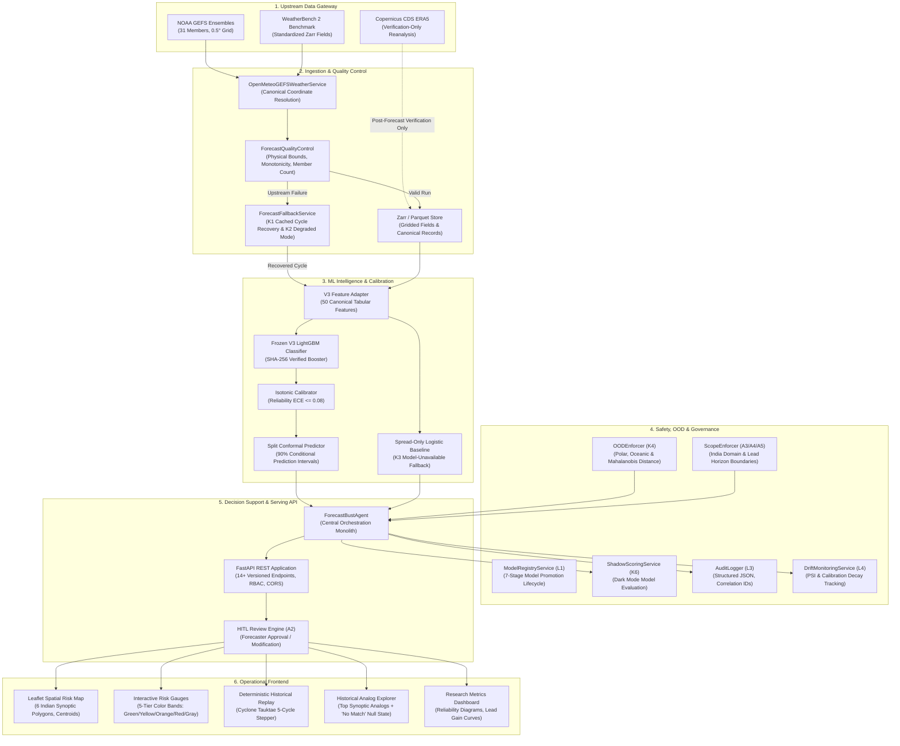
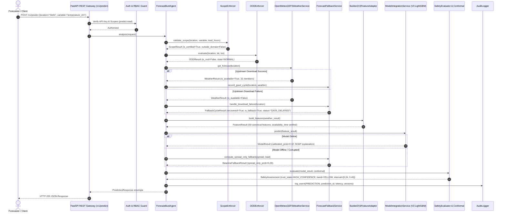
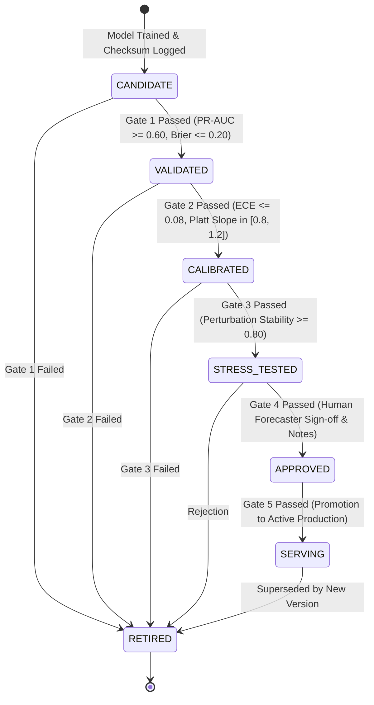

# Veyra Sentinel — System Architecture Specification

**Problem Statement:** SIH26079 — AI-Based Forecast Bust Detection for Medium-Range Weather Forecasts  
**Organization:** Ministry of Earth Sciences (MoES) / National Centre for Medium Range Weather Forecasting (NCMRWF)  
**Theme:** Disaster Management  
**Architecture Classification:** Modular Monolith with Tiered Reliability, Safety, and Governance Layers  

---

## 1. Executive Architectural Overview

Veyra Sentinel is an **AI-powered reliability layer placed on top of existing numerical weather prediction (NWP) systems**. Rather than attempting to simulate atmospheric physics or replace operational NWP models (e.g. NOAA GEFS, NCMRWF NEPS), Sentinel monitors the operational forecast process itself. At forecast issue time, it evaluates whether the forecast is prone to an unusually large future error (**forecast bust**) across the Indian subcontinent.

The architecture is designed around four strict operational invariants:
1. **Issue-Time Safety**: Zero future information or verifying ground truth (ERA5) may leak into inference features (`availability_time <= issue_time`).
2. **Deterministic Fallbacks**: Graceful degradation under data latency (`DATA_DELAYED`), missing ensemble members, and model corruption (calibrated spread-only baseline).
3. **Conservative Abstention**: The system explicitly withholds numeric probabilities and says *"I don't know — human review required"* when encountering out-of-distribution (OOD) states or uncertified conditions.
4. **Human-in-the-Loop Governance**: Automated AI risk scores must pass operational meteorologist review before dissemination into official district disaster bulletins.

---

## 2. High-Level System Architecture



---

## 3. End-to-End Pipeline & Request Flow



---

## 4. Failure Handling & Degradation Topology (§21)

Veyra Sentinel implements an exhaustive, non-silent failure matrix ensuring no error condition is ever hidden from human decision-makers:

```mermaid
flowchart TD
    Start([Inference Request]) --> CheckGeo{Location Check}
    
    CheckGeo -->|Polar / Deep Ocean| AbstainOOD[ABSTAIN: OUT_OF_DISTRIBUTION<br/>Suppress Probabilities<br/>Human Review Required]
    CheckGeo -->|Foreign City| WarnGeo[Serve with UNSUPPORTED_GEOGRAPHIC_REGION<br/>outside_certified_domain=True]
    CheckGeo -->|Certified Indian Domain| CheckWeather{Weather Data Fetch}

    WarnGeo --> CheckWeather

    CheckWeather -->|Failure / Timeout| CheckCache{Cached Cycle Exists?}
    CheckCache -->|Yes| FallbackK1[Recover Cached Previous Cycle<br/>Flag status='DATA_DELAYED'<br/>is_fallback_cycle=True]
    CheckCache -->|No| AbstainWeather[ABSTAIN: DATA_UNAVAILABLE<br/>bust_probability=null<br/>trust_state=UNAVAILABLE]

    CheckWeather -->|Success| CheckMembers{Ensemble Completeness}
    FallbackK1 --> CheckMembers

    CheckMembers -->|< 10 Members| AbstainEnsemble[ABSTAIN: INSUFFICIENT_MEMBERS<br/>bust_probability=null<br/>Critical Data Degradation]
    CheckMembers -->|10–30 Members| DegradeK2[DEGRADED MODE: Incomplete Ensemble<br/>Inflate Uncertainty by sqrt(31/N)<br/>Flag is_degraded=True]
    CheckMembers -->|31/31 Members| CheckModel{Primary ML Model}
    DegradeK2 --> CheckModel

    CheckModel -->|Model Offline / Missing| FallbackK3[CALIBRATED SPREAD-ONLY BASELINE<br/>Logistic Regression Baseline<br/>Flag is_baseline_fallback=True]
    CheckModel -->|Model Operational| RunGBM[V3 LightGBM Inference<br/>Isotonic Calibration<br/>Conformal Prediction Interval]

    FallbackK3 --> AssembleResponse[Assemble Standardized Prediction Envelope]
    RunGBM --> AssembleResponse
    
    AssembleResponse --> End([Dispatch HTTP Response])
    AbstainOOD --> End
    AbstainWeather --> End
    AbstainEnsemble --> End
```

---

## 5. Model Lifecycle & Promotion State Machine (§22, L1)

Model versions must navigate a strict 7-stage promotion lifecycle before serving live predictions:



---

## 6. Component Responsibilities & Package Structure

| Package / Module | Responsibility | Key Invariants Enforced |
|---|---|---|
| `backend/app/agents/` | Central orchestration monolith (`ForecastBustAgent`). | Coordinates all downstream services; never mutates feature vectors; applies zero lookahead. |
| `backend/app/services/openmeteo_service.py` | Upstream weather ingestion for NOAA GEFS ensembles. | Harmonizes units (Kelvin, Pa, m/s); enforces 31-member ensemble structure; validates coordinate bounds. |
| `backend/app/safety/ood_enforcement.py` | Authoritative Out-Of-Distribution gating. | Polar $|\text{lat}| \ge 66.5^\circ$, oceanic domains, and Mahalanobis distance $> 3.0$ strictly withhold confident probabilities. |
| `backend/app/safety/scope_enforcer.py` | Certified operational scope enforcement. | Indian subcontinental domain bounds; 24h–240h lead horizon limits; core variable certification. |
| `backend/app/services/fallback_service.py` | Operational fallbacks for download dropouts, missing members, and model downtime. | Last good cycle retrieval (`DATA_DELAYED`); uncertainty inflation for 10–30 members; calibrated spread-only fallback. |
| `backend/app/services/model_registry.py` | Enterprise model governance and lifecycle transitions. | 7-stage promotion gates (`CANDIDATE` to `SERVING`); prevents unauthorized model activation. |
| `backend/app/services/shadow_scoring.py` | Shadow/dark mode model evaluation. | Compares candidate vs serving model divergence and bias over empirical sample budgets. |
| `backend/app/core/auth.py` | Security, authentication, and defensive engineering. | 4-tier RBAC (`ADMIN`, `FORECASTER`, `RESEARCHER`, `VIEWER`); API key guards; input bounds sanitization. |
| `backend/app/core/audit_logger.py` | Structured audit event logging. | Structured JSON emission with `audit_id`, `prediction_id`, latency, and circular buffer querying. |
| `backend/app/services/drift_monitor.py` | Online feature drift and calibration decay monitoring. | Feature Population Stability Index (PSI); verification Brier score deterioration; automated retraining proposals. |
| `backend/app/api/v1/endpoints/review.py` | Human-in-the-Loop approval gate. | Forecaster review states (`APPROVED`, `MODIFIED`, `REJECTED`) for bulletin dissemination. |
| `backend/app/services/analog_service.py` | Historical weather analog discovery. | Temporal causality enforcement; B6 event exclusion; clean `"No eligible analog found"` null state. |
| `backend/app/services/spatial_service.py` | Spatial extent, object detection, and risk zones. | 6 Indian synoptic risk polygons; 42.5 km centroid error circles; Fractions Skill Score (FSS). |

---

## 7. Complete API Route Map (All 14+ Endpoints)

| Method | Path | Summary | Auth Role | Description |
|---|---|---|---|---|
| `GET` | `/v1/health` | Liveness & Readiness Probe | Public | Returns service status, version, and dependency health. |
| `POST` | `/v1/predict` | Single-Horizon Bust Risk Evaluation | Public / Key | Standard prediction endpoint returning full prediction envelope. |
| `POST` | `/v1/predict/batch` | Multi-Location Batch Prediction | Public / Key | Concurrent evaluation across up to 50 locations with failure isolation. |
| `POST` | `/v1/dashboard/intelligence` | Multi-Horizon Trajectory Intelligence | Public / Key | 16-day and 7-day risk trajectories, summary statistics, and scientific context. |
| `GET` | `/v1/models` | Model Registry Catalog | Viewer | Lists all registered models, lifecycle statuses, and performance metrics. |
| `GET` | `/v1/models/{id}` | Model Version Details | Viewer | Returns model architecture, training window, SHA-256 hash, and status. |
| `POST` | `/v1/models/{id}/promote` | Model Lifecycle Promotion | Admin | Promotes model to next lifecycle stage if gate criteria are satisfied. |
| `GET` | `/v1/models/{id}/gates` | Promotion Gate Assessment | Researcher | Evaluates candidate model against promotion acceptance criteria. |
| `GET` | `/v1/forecasts` | Available Forecast Cycles | Viewer | Lists cached and historical forecast cycles available for evaluation. |
| `GET` | `/v1/risk-map` | GeoJSON Spatial Risk Overlays | Viewer | Returns 6 synoptic Indian risk polygons and centroid coordinates. |
| `GET` | `/v1/analogs` | Historical Analog Search | Viewer | Returns top similar historical weather cases or authoritative null state. |
| `GET` | `/v1/explanation` | Explainability & SHAP Attribution | Viewer | Returns signed SHAP bars, timestamps, and auditable reason codes. |
| `GET` | `/v1/metrics` | Operational & Evaluation Metrics | Researcher | Returns PR-AUC, Brier score, ECE, reliability diagrams, and ops counters. |
| `GET` | `/v1/metadata` | System & License Metadata | Public | System versions, open data licenses, and claim scope statements. |
| `GET` | `/v1/data-provenance` | Data Provenance & Lineage | Viewer | Artifact SHA-256 hashes, source URLs, and verification invariants. |
| `GET` | `/v1/export` | Multi-Format Data Export | Researcher | Bounded export in CSV, JSON, GeoJSON, and NetCDF formats. |
| `POST` | `/v1/predictions/{id}/review` | Submit Forecaster Review | Forecaster | Records meteorologist approval, modification, or rejection. |
| `GET` | `/v1/predictions/{id}/review` | Retrieve Prediction Review | Viewer | Retrieves HITL review status and forecaster notes. |
