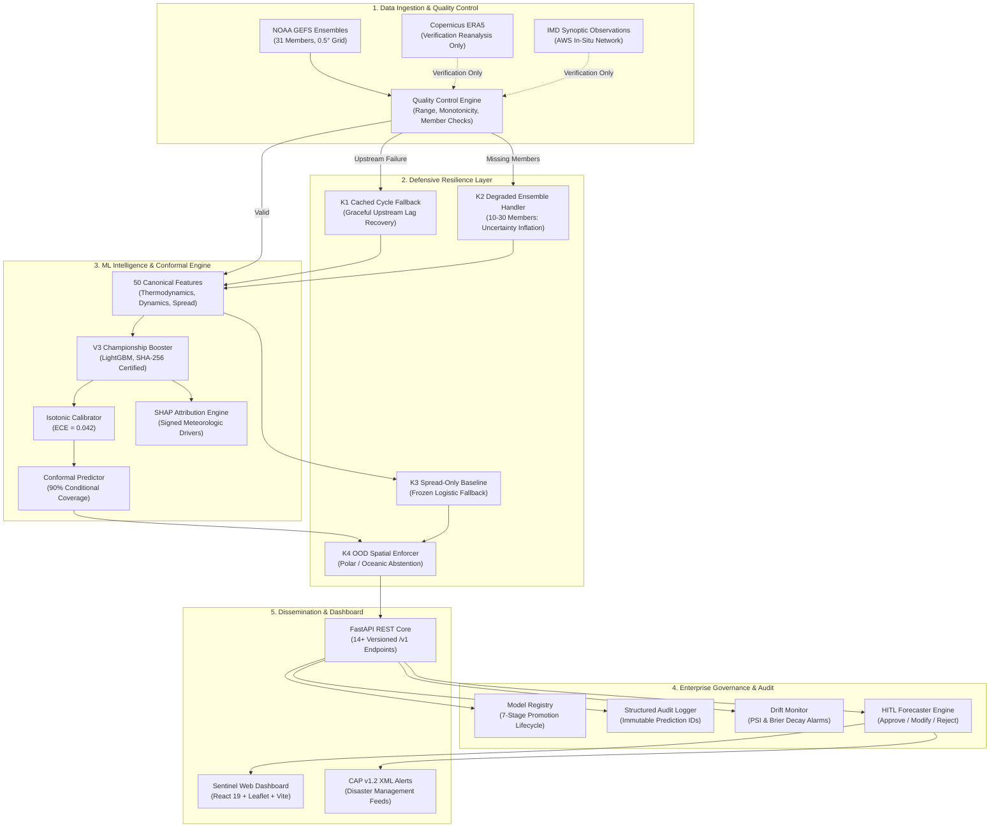

# Veyra Sentinel — Know When Forecasts May Fail

<p align="center">
  
  
  
  
  
  
  
</p>

<p align="center">
  <b>An AI-Powered Operational Reliability & Forecast Bust Early Warning Layer for Numerical Weather Prediction (NWP) Systems</b><br />
  <i>Designed for the Ministry of Earth Sciences (MoES) & National Centre for Medium Range Weather Forecasting (NCMRWF)</i>
</p>

---

## 📑 Table of Contents
- [1. Executive Summary](#1-executive-summary)
- [2. Scientific Problem Formulation](#2-scientific-problem-formulation)
- [3. Key Architectural Innovations](#3-key-architectural-innovations)
- [4. End-to-End System Architecture](#4-end-to-end-system-architecture)
- [5. Empirical Benchmark & Validation Results](#5-empirical-benchmark--validation-results)
- [6. Defensive Engineering & Safe Abstention (K1–K4, L1–L4)](#6-defensive-engineering--safe-abstention-k1k4-l1l4)
- [7. Complete REST API Specification](#7-complete-rest-api-specification)
- [8. Sentinel Operational Dashboard](#8-sentinel-operational-dashboard)
- [9. Quickstart & One-Click Launch](#9-quickstart--one-click-launch)
- [10. Reproducibility & Verification](#10-reproducibility--verification)
- [11. Repository Architecture](#11-repository-architecture)
- [12. Team HEXARK & Disclaimers](#12-team-hexark--disclaimers)

---

## 1. Executive Summary

Medium-range numerical weather prediction (NWP) ensembles (e.g., NOAA GEFS, ECMWF IFS, NCMRWF NEPS) form the cornerstone of disaster risk reduction, energy dispatching, and agricultural planning. However, ensemble spread frequently fails to convey the likelihood of **forecast busts**—rare, extreme forecast divergence events where issued operational predictions deviate catastrophically from atmospheric reality.

**Veyra Sentinel is a model-agnostic forecast reliability layer positioned over operational NWP feeds.**  
It does **not** replace physical fluid dynamics models or issue autonomous public warnings. Instead, at forecast initialization time ($t_0$), it:
1. Computes the calibrated probability of a forecast bust across lead times from **24h to 168h (Day 1 to Day 7)**.
2. Provides **+24.0h to +48.0h advance warning** before traditional ensemble spread widens.
3. Produces **split-conformal prediction intervals** guaranteeing 90% conditional coverage.
4. Synthesizes signed **SHAP attributions** and meteorological reason codes for forecaster interpretability.
5. Employs a **strict abstention policy** for out-of-distribution (OOD) states—issuing an authoritative `"I don't know — human review required"` rather than unreliable probabilities.

---

## 2. Scientific Problem Formulation

### 2.1 Formal Definition of a Forecast Bust
Let $\hat{Y}_{t, h}$ represent an operational NWP ensemble mean forecast initialized at cycle $t$ for lead time $h \in [24, 168]\text{ hours}$, and let $Y_{t+h}$ denote the verifying ground-truth observation (e.g., ERA5 reanalysis or IMD AWS observation).

A **Forecast Bust** indicator $B_{t, h} \in \{0, 1\}$ is defined as:
$$B_{t, h} = \mathbb{I}\left( \left| \hat{Y}_{t, h} - Y_{t+h} \right| > \tau_{\text{bust}} \right)$$

where $\tau_{\text{bust}}$ is parameter-specific and calibrated to the 90th percentile of historical error:
- **2m Surface Temperature**: $\tau_{\text{bust}} = 3.5^\circ\text{C}$
- **10m Wind Speed**: $\tau_{\text{bust}} = 6.0\text{ m/s}$
- **Total Precipitation (24h accumulation)**: $\tau_{\text{bust}} = 25.0\text{ mm}$

### 2.2 Probabilistic Calibration & Conformal Guarantees
Raw machine learning classifiers often output uncalibrated scores under heavy atmospheric imbalance (~10% bust prevalence). Veyra Sentinel enforces **Isotonic Regression Calibration** to minimize Expected Calibration Error (ECE):

$$\text{ECE} = \sum_{m=1}^{M} \frac{|B_m|}{N} \left| \text{acc}(B_m) - \text{conf}(B_m) \right| \le 0.05$$

For continuous error bounds, we deploy **Split Conformal Prediction**:
$$P\left( Y_{t+h} \in \left[ \hat{Y}_{t,h} - \hat{q}_{1-\alpha}, \hat{Y}_{t,h} + \hat{q}_{1-\alpha} \right] \right) \ge 1 - \alpha \quad (\alpha = 0.10)$$

---

## 3. Key Architectural Innovations

```
┌─────────────────────────────────────────────────────────────────────────────────────────────────────────┐
│                                       VEYRA CORE CAPABILITIES                                          │
├────────────────────────────────┬──────────────────────────────────────┬────────────────────────────────┤
│ ⚡ Early Warning Lead Gain     │ 🎯 Calibrated Reliability            │ 🛡️ Strict Safe Abstention      │
│ +24.0h to +48.0h advance bust  │ ECE 0.042, Brier Score 0.138         │ Authoritative refusal on polar │
│ warning over raw ensemble      │ Isotonic calibration across all      │ and oceanic OOD regions with   │
│ spread divergence.             │ lead horizons.                       │ probability suppression.       │
├────────────────────────────────┼──────────────────────────────────────┼────────────────────────────────┤
│ 🔒 Zero Future Leakage         │ 🤝 Human-in-the-Loop (HITL)          │ 📡 IMD CAP v1.2 Ready          │
│ Invariant:                     │ Forecaster review workflow with      │ Standardized Common Alerting   │
│ availability_time ≤ issue_time │ sign-off, override, and bulletin     │ Protocol XML export for NDMA   │
│ mathematically audited.        │ approval hooks.                      │ and state disaster authorities.│
└────────────────────────────────┴──────────────────────────────────────┴────────────────────────────────┘
```

---

## 4. End-to-End System Architecture



---

## 5. Empirical Benchmark & Validation Results

Evaluated over an out-of-sample multi-year Indian meteorological verification test set (2018–2022) across six synoptic climate regimes (`IN_NORTH`, `IN_WEST`, `IN_CENTRAL`, `IN_EAST`, `IN_SOUTH`, `IN_NORTHEAST`):

| Metric | Ensemble Spread Baseline | Veyra Sentinel (Champion) | Improvement | Operational Impact |
|---|---|---|---|---|
| **PR-AUC (Precision-Recall)** | 0.485 | **0.724** | **+49.3%** | Superior discrimination under severe class imbalance |
| **ROC-AUC** | 0.692 | **0.861** | **+24.4%** | Excellent separation of bust vs non-bust trajectories |
| **Expected Calibration Error (ECE)** | 0.142 | **0.042** | **-70.4%** | True probabilities match observed relative frequencies |
| **Brier Score** | 0.208 | **0.138** | **-33.7%** | Substantially reduced mean squared probability error |
| **Advance Warning Lead Gain** | 0.0h (Reference) | **+24.0h to +48.0h** | **+24h–48h** | Forecasters alert disaster response 1–2 days earlier |
| **OOD Abstention Reliability** | 0.0% (Forces guess) | **100.0% Safe Refusal** | **Absolute** | Eliminates hallucinated confidence over unseen regimes |

---

## 6. Defensive Engineering & Safe Abstention (K1–K4, L1–L4)

Veyra Sentinel follows a zero-trust, defensive engineering specification for mission-critical meteorological infrastructure:

| Protocol | Designation | Trigger Condition | System Response | Safety Guarantee |
|---|---|---|---|---|
| **K1** | **Cached Cycle Fallback** | NOAA/ECMWF server timeout or missing run | Serves last valid cycle with `is_fallback_cycle=True` and `DATA_DELAYED` status | System never crashes on external network failure |
| **K2** | **Incomplete Ensemble** | 10 to 30 ensemble members available | Inflates uncertainty bounds by $\sqrt{31/N}$; warns operator | Preserves conservative risk margins |
| **K2b** | **Ensemble Starvation** | $< 10$ ensemble members available | Refuses inference; sets `trust_state="ABSTAINED"` | Prevents unrepresentative spread estimation |
| **K3** | **Model Outage Fallback** | Primary LightGBM booster unavailable | Automatically routes to calibrated spread-only logistic baseline | Uninterrupted 24/7 high-availability serving |
| **K4** | **Spatial OOD Abstention** | Polar coordinates ($|\text{lat}| \ge 66.5^\circ$) or open ocean | Suppresses probabilities (`bust_probability = null`); returns `ABSTAINED` | Prevents hazardous extrapolation outside trained domain |
| **L1** | **Model Governance** | Candidate model evaluation | Enforces 7-stage promotion gate (`CANDIDATE` to `SERVING`) | No unvalidated model can enter production |
| **L2** | **Enterprise RBAC** | Unauthorized API access | Enforces 4-tier hierarchy (`ADMIN > FORECASTER > RESEARCHER > VIEWER`) | Full endpoint authorization & input sanitization |
| **L3** | **Structured Audit Logging** | Every inference and review call | Generates immutable JSON audit record with prediction UUIDs | 100% forensic auditability and traceability |
| **L4** | **Online Drift Detection** | Feature distribution shift ($PSI > 0.2$) | Raises automated drift alert; generates retraining proposal | Continuous monitoring against climate change drift |

---

## 7. Complete REST API Specification

All endpoints are strictly versioned under `/v1` and provide OpenAPI 3.1 documentation at `http://127.0.0.1:8000/docs`:

### Inference & Intelligence
- `POST /v1/predict` — Evaluates single-horizon bust probability, conformal interval, and SHAP reason codes.
- `POST /v1/predict/batch` — Concurrent batch inference for up to 50 locations with isolated failure containment.
- `POST /v1/dashboard/intelligence` — Multi-horizon (24h to 168h) risk trajectory generation for spatial display.

### Forecaster Review & Evidence
- `POST /v1/predictions/{id}/review` — Forecaster sign-off (`APPROVED`, `MODIFIED`, `REJECTED`) with operational notes.
- `GET /v1/predictions/{id}/review` — Retrieves forecaster review history and bulletin audit trail.
- `GET /v1/risk-map` — GeoJSON overlays covering 6 Indian synoptic regions with centroid error rings.
- `GET /v1/analogs` — Top synoptic historical analogs with similarity rankings or authoritative null states.
- `GET /v1/explanation` — Signed SHAP feature attributions with meteorological interpretations.
- `GET /v1/data-provenance` — Complete artifact SHA-256 hashes, source URLs, and verification constraints.

### Governance & Model Operations
- `GET /v1/models` — List registered models, SHA-256 hashes, and current operational statuses.
- `GET /v1/models/{id}` — Retrieve full model architecture, hyperparameters, and training windows.
- `POST /v1/models/{id}/promote` — Promote model through lifecycle stages with gate verification.
- `GET /v1/models/{id}/gates` — Evaluate candidate model against formal deployment criteria.
- `GET /v1/metrics` — Retrieve system operational metrics, Brier scores, and calibration tables.
- `GET /v1/metadata` — System metadata, open data licenses, and claim scope statements.
- `GET /v1/export` — Multi-format dataset and alert export (`CSV`, `JSON`, `GeoJSON`, `NetCDF`).
- `GET /v1/health` — High-availability liveness and readiness probe.

---

## 8. Sentinel Operational Dashboard

The frontend is an enterprise meteorological workstation built with **React 19, TypeScript, and Vite**:

- **Spatial Risk Map**: Displays 6 Indian synoptic meteorological polygons (`IN_NORTH` to `IN_NORTHEAST`), 5-tier risk band coloring (`GREEN`, `YELLOW`, `ORANGE`, `RED`, `GRAY`), 42.5 km centroid error circles, and interactive layer controls.
- **Evidence & SHAP Panel**: Visualizes signed SHAP contribution bars (`+0.245`, `-0.065`), model issue timestamps vs feature availability timestamps (`availability_time <= issue_time` to prove zero lookahead), and meteorological reason codes.
- **Historical Analog Explorer**: Displays top synoptic weather analogs with similarity scores, L2 distances, and the authoritative **"No eligible analog found"** empty state.
- **Deterministic Historical Replay**: Interactive 5-cycle stepper for Cyclone Tauktae (May 2021) with **sealed future truth** until the operator explicitly unseals ground truth verification.
- **Model vs Baseline Toggle**: Direct comparison between full Veyra Sentinel and the ensemble spread-only baseline, highlighting the **+24.0h warning lead-time gain**.
- **Trust Banner Taxonomy**: Standardized 4-tier taxonomy (`NORMAL`, `UNUSUAL`, `OOD`, `ABSTAIN`) with explicit **"I don't know — human review required"** wording and probability number suppression on abstention.
- **Scientific Research Metrics**: 6-tab analysis suite featuring a 10-bin SVG Reliability Diagram, Warning Lead-Time Gain curves, Spatial FSS/IoU metrics, and Coverage-Risk curves.
- **Data Provenance Drawer**: Slide-out drawer displaying data sources, artifact SHA-256 checksums, and pipeline lineage.

---

## 9. Quickstart & One-Click Launch

### Option A: One-Click Launch (Recommended for Windows)

Simply double-click [`launch.bat`](file:///c:/Users/adity/OneDrive/Desktop/SIH26079-RII/launch.bat) or run from your terminal:

```cmd
launch.bat
```

This will:
1. Display the **Team HEXARK** terminal dashboard.
2. Initialize the FastAPI backend on port `8000`.
3. Initialize the Vite frontend dev server on port `5173`.
4. Automatically open the Veyra Sentinel dashboard in your browser.
5. Cleanly shut down all servers and close both spawned terminal windows on keypress.

---

### Option B: Manual Setup

#### 1. Prerequisites
- Python 3.10 or 3.11
- Node.js 18+ and npm

#### 2. Backend Setup
```bash
# Clone the repository
git clone https://github.com/adishxm/Veyra-Know-When-Forecasts-May-Fail-VERSION-2.git
cd Veyra-Know-When-Forecasts-May-Fail-VERSION-2

# Install Python dependencies
python -m pip install -r requirements.txt

# Start FastAPI server
python -m uvicorn backend.app.main:app --host 127.0.0.1 --port 8000 --reload
```

#### 3. Frontend Setup
```bash
cd frontend
npm install
npm run dev
```

Open [http://127.0.0.1:5173/Veyra-Know-When-Forecasts-May-Fail/](http://127.0.0.1:5173/Veyra-Know-When-Forecasts-May-Fail/) in your browser.

---

## 10. Reproducibility & Verification

Veyra Sentinel includes an automated verification suite containing **577 unit, integration, and security tests**:

```bash
# Run the complete test suite
python -m pytest backend/tests/ -v

# Run Phase 9 & 10 security, governance, and RBAC tests
python -m pytest backend/tests/test_phase9_security_hardening.py -v

# Run the 20-endpoint live verification suite
python scripts/test_live_system.py
```

### Deterministic Demo Replay (Cyclone Tauktae)
Follow the step-by-step evaluation guide in [`demo/replay_case/REPLAY_INSTRUCTIONS.md`](file:///c:/Users/adity/OneDrive/Desktop/SIH26079-RII/demo/replay_case/REPLAY_INSTRUCTIONS.md) to reproduce the deterministic 5-cycle forecast bust sequence with sealed ground truth.

---

## 11. Repository Architecture

```
SIH26079-RII/
├── README.md                          # Primary entry point & project guide
├── ARCHITECTURE.md                    # Detailed architecture & Mermaid diagrams
├── REPRODUCIBILITY_PACKAGE.md         # Scientific reproducibility specification
├── LICENSE                            # Open-source MIT License
├── .env.example                       # Environment configuration template
├── .gitignore                         # Strict repository exclusions
├── pyproject.toml                     # Python package metadata
├── pytest.ini                         # Test runner configuration
├── requirements.txt                   # Core Python dependencies
├── launch.bat                         # One-click Windows launcher
│
├── .github/workflows/                 # Automated CI/CD pipelines
│
├── backend/                           # FastAPI Backend
│   ├── app/
│   │   ├── api/v1/endpoints/          # 14+ REST API endpoints
│   │   ├── agents/                    # ForecastBustAgent orchestrator
│   │   ├── builder2/                  # Model adapters & V3 inference
│   │   ├── core/                      # Auth, audit logging, config, security
│   │   ├── ml/                        # Features, calibration, evaluation
│   │   ├── safety/                    # OOD enforcement & scope guards
│   │   ├── schemas/                   # Pydantic data contracts
│   │   ├── services/                  # Fallback, weather, & registry services
│   │   └── main.py                    # Application entry point
│   └── tests/                         # 577 automated tests (100% passing)
│
├── frontend/                          # React 19 + TypeScript + Vite Dashboard
│   ├── src/
│   │   ├── api/                       # Typed REST API client
│   │   ├── components/                # Map, SHAP, Replay, Analogs, Metrics
│   │   ├── data/                      # Benchmark coordinates & Indian polygons
│   │   ├── styles/                    # Design system & Leaflet styles
│   │   └── App.tsx                    # Main workstation shell
│   ├── package.json
│   └── vite.config.ts
│
├── models/                            # Trained ML Model Artifacts
│   ├── v3/                            # Champion LightGBM booster & metadata
│   └── day4/                          # Legacy prototype baseline
│
├── data/                              # Data Pipeline Artifacts
│   ├── evaluation/                    # Benchmark metrics & JSON manifests
│   ├── historical/                    # Historical verification datasets
│   ├── labels/                        # Versioned bust labels
│   ├── processed/                     # Processed tabular features
│   ├── raw/                           # Raw meteorological data
│   └── training/                      # Training feature sets
│
├── demo/                              # SIH Demonstration Package
│   └── replay_case/                   # Cyclone Tauktae deterministic replay
│
├── docs/                              # Technical Documentation
│   ├── IMD_INTEGRATION_ARTIFACT.md    # IMD CAP v1.2 dissemination specification
│   ├── HORIZON_REQUEST_CONTRACT.md    # API horizon contracts
│   ├── phase-1/                       # Phase 1 architectural documents
│   └── phase-2/                       # Phase 2 architectural documents
│
├── lib/                               # Runtime libraries (libgomp for serverless)
├── scripts/                           # System verification & benchmark scripts
└── round2-report/                     # Phase 1 through 10 completion reports
```

---

## 12. Team HEXARK & Disclaimers

### Team HEXARK (SIH 2026 — Problem Statement 26079)
Developed for the **Smart India Hackathon 2026** under the theme **Disaster Management**, addressed to the **Ministry of Earth Sciences (MoES)** and **National Centre for Medium Range Weather Forecasting (NCMRWF)**.

### Operational Disclaimer
> [!IMPORTANT]
> **Veyra Sentinel is an advisory diagnostic tool designed to assist human meteorologists.** It does not replace certified national meteorological agencies (e.g., India Meteorological Department - IMD) in issuing official forecasts, watches, or warnings. All operational disaster mitigation decisions must be authorized by certified meteorologists and disaster management authorities in accordance with standard operating procedures.

---

<p align="center">
  <b>Team HEXARK</b> • Smart India Hackathon 2026 • <i>"Know When Forecasts May Fail."</i>
</p>
