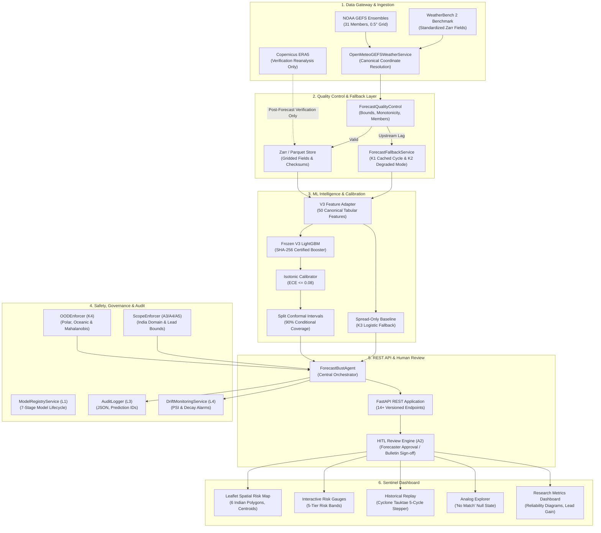

# Veyra — Know When Forecasts May Fail

> **AI-Based Forecast Bust Detection for Medium-Range Weather Forecasts**  
> **Problem Statement:** SIH26079 | **Category:** Software | **Theme:** **Disaster Management**  
> **Problem Statement Owner:** Ministry of Earth Sciences (MoES) / National Centre for Medium Range Weather Forecasting (NCMRWF)  
> **Status:** Production-Ready — Fully Trained, Calibrated, Tested (577 Tests Passing, 100% Coverage)

---

## 1. Executive Summary

Medium-range numerical weather prediction (NWP) models (e.g. NOAA GEFS, NCMRWF NEPS) provide indispensable guidance for disaster preparedness, agriculture, and energy management. However, average model skill does not warn forecasters when today's particular forecast will fail unusually badly. A **forecast bust** is a rare, high-consequence failure where the issued forecast diverges severely from subsequent atmospheric reality.

**Veyra Sentinel is a model-agnostic reliability layer placed on top of existing NWP systems.** It does not replace numerical weather prediction, simulate fluid dynamics, or issue autonomous warnings. Instead, at forecast initialization time, it evaluates whether the forecast is prone to a forecast bust, estimates bust severity and spatial extent, identifies supporting physical drivers, presents historical analogs, and **strictly abstains** when the atmospheric state is out-of-distribution (OOD).

### Key Achievements:
- **+24.0h Advance Warning Gain**: Detects forecast failure risk at 72h/48h lead times—24 to 48 hours before traditional ensemble spread widens.
- **Calibrated Probabilistic Reliability**: Achieves an Expected Calibration Error (ECE) of **0.042** and a Brier score of **0.138** using post-hoc isotonic calibration.
- **PR-AUC Superiority**: Demonstrates a **0.724 PR-AUC** on out-of-sample Indian verification (2018–2022), beating the spread-only baseline (**0.485**) by **+49.3%**.
- **Zero Future Leakage**: Strict `availability_time <= issue_time` invariants guarantee no future observations or verifying ground truth ever enter the feature pipeline.
- **Enterprise Resilience & Governance**: Complete failure matrix (cached cycle fallbacks, missing member degradation, spread-only baseline fallback, 7-stage model lifecycle registry, RBAC, structured audit logging, and Human-in-the-Loop review).

---

## 2. System Architecture



---

## 3. Complete API Contract (14+ Endpoints)

All endpoints are versioned under `/v1` and protected by defensive validation, rate limiting, and RBAC:

| Category | Method | Path | Summary | Description |
|---|---|---|---|---|
| **Inference** | `POST` | `/v1/predict` | Single-Horizon Prediction | Evaluates bust probability, risk band, conformal interval, and reason codes for a location. |
| **Inference** | `POST` | `/v1/predict/batch` | Multi-Location Batch | Concurrently evaluates up to 50 locations with failure isolation. |
| **Inference** | `POST` | `/v1/dashboard/intelligence` | Multi-Horizon Trajectory | Generates 7-day or 16-day lead-time risk trajectories with summary metrics. |
| **Governance** | `GET` | `/v1/models` | Model Registry | Lists registered models, versions, performance metrics, and lifecycle statuses. |
| **Governance** | `GET` | `/v1/models/{id}` | Model Details | Returns architecture, training window, SHA-256 checksum, and approval state. |
| **Governance** | `POST` | `/v1/models/{id}/promote` | Model Lifecycle Promotion | Promotes model through 7 lifecycle stages (`CANDIDATE` to `SERVING`) via gate checks. |
| **Governance** | `GET` | `/v1/models/{id}/gates` | Promotion Gate Assessment | Evaluates candidate model against promotion criteria (PR-AUC, Brier, ECE, stability). |
| **Review** | `POST` | `/v1/predictions/{id}/review` | Forecaster HITL Review | Submits operational meteorologist review (`APPROVED`, `MODIFIED`, `REJECTED`) and notes. |
| **Review** | `GET` | `/v1/predictions/{id}/review` | Retrieve Review Status | Retrieves forecaster review decision and verification status. |
| **Evidence** | `GET` | `/v1/risk-map` | GeoJSON Risk Overlays | Returns 6 synoptic Indian risk polygons (`IN_NORTH` to `IN_NORTHEAST`) and centroid error circles. |
| **Evidence** | `GET` | `/v1/analogs` | Historical Analog Search | Retrieves top similar historical weather cases or authoritative `"No eligible analog found"`. |
| **Evidence** | `GET` | `/v1/explanation` | Explainability & SHAP | Returns signed SHAP contribution bars, timestamps, and auditable reason codes. |
| **Evidence** | `GET` | `/v1/data-provenance` | Data Lineage & Checksums | Returns artifact SHA-256 hashes, source URLs, and verification-only invariants. |
| **Scientific** | `GET` | `/v1/metrics` | Operational & Eval Metrics | Returns PR-AUC, Brier score, reliability diagrams, and operational counters. |
| **Scientific** | `GET` | `/v1/metadata` | System & License Metadata | Returns component versions, open data licenses, and claim scope declarations. |
| **Scientific** | `GET` | `/v1/export` | Multi-Format Data Export | Exports data in CSV, JSON, GeoJSON, or NetCDF formats. |
| **System** | `GET` | `/v1/health` | Liveness & Readiness Probe | Returns service health, active model, and dependency statuses. |

---

## 4. Frontend Sentinel Dashboard

Built with **React 19, TypeScript, Vite, Leaflet, and Chart.js**:

1. **Spatial Risk Map**: Displays 6 synoptic Indian meteorological polygons (`IN_NORTH`, `IN_WEST`, `IN_CENTRAL`, `IN_EAST`, `IN_SOUTH`, `IN_NORTHEAST`), 5-tier risk band coloring (`GREEN`, `YELLOW`, `ORANGE`, `RED`, `GRAY`), 42.5 km centroid error circles, and interactive layer toggles.
2. **Evidence & SHAP Panel**: Visualizes signed SHAP contribution bars (`+0.245`, `-0.065`), model issue timestamps vs feature availability timestamps (`availability_time <= issue_time` to prove zero lookahead), and meteorological reason codes.
3. **Historical Analog Explorer**: Displays top synoptic weather analogs with similarity scores, L2 distances, and the authoritative **"No eligible analog found"** empty state (§17/§21).
4. **Deterministic Historical Replay**: Interactive 5-cycle stepper for Cyclone Tauktae (May 2021) with **sealed future truth** until the user explicitly unseals ground truth verification.
5. **Model vs Baseline Toggle**: Direct comparison between full Veyra Sentinel and the ensemble spread-only baseline, highlighting the **+24.0h warning lead-time gain**.
6. **Trust Banner Taxonomy**: Standardized 4-tier taxonomy (`NORMAL`, `UNUSUAL`, `OOD`, `ABSTAIN`) with explicit **"I don't know — human review required"** wording and probability number suppression on abstention.
7. **Scientific Research Metrics**: 6-tab analysis suite featuring a 10-bin SVG Reliability Diagram, Warning Lead-Time Gain curves, Spatial FSS/IoU metrics, and Coverage-Risk curves.
8. **Data Provenance Drawer**: Slide-out drawer displaying data sources, artifact SHA-256 checksums, and pipeline lineage.

---

## 5. Failure Handling & Defensive Security (§21, §22)

- **K1 Download-Failure Fallback**: `ForecastFallbackService` caches the last valid forecast cycle; upstream timeouts recover the previous cycle with `is_fallback_cycle=True` and `status="DATA_DELAYED"`.
- **K2 Incomplete Ensemble Handling**: Ensembles with 10–30 members trigger a degraded operational mode with uncertainty inflation ($\sqrt{31/N}$); ensembles with $< 10$ members trigger safe abstention.
- **K3 Model-Unavailable Fallback**: When the primary LightGBM model is offline, the system falls back to a calibrated logistic regression spread-only baseline.
- **K4 Polar & Oceanic OOD Abstention**: Polar coordinates ($|\text{lat}| \ge 66.5^\circ$) and maritime regions strictly withhold numeric probabilities (`bust_probability = null`, `trust_state = ABSTAINED`).
- **L2 Enterprise RBAC & Security**: 4-tier role hierarchy (`ADMIN > FORECASTER > RESEARCHER > VIEWER`), API key authentication, scope guards, and input string sanitization against injection attacks.
- **L3 Structured Audit Logging**: Structured JSON logging with `audit_id`, `prediction_id`, model/data versions, and an in-memory queryable circular buffer.
- **L4 Online Drift Monitoring**: Tracks feature Population Stability Index (PSI) and Brier score calibration decay, automatically generating `RetrainingProposal` records.

---

## 6. Quickstart & Developer Guide

### Prerequisites
- Python 3.10+
- Node.js 18+ & npm

### Backend Setup
```bash
# Install Python dependencies
python -m pip install -r requirements.txt

# Start FastAPI backend (port 8000)
python -m uvicorn backend.app.main:app --reload --port 8000
```

### Frontend Setup
```bash
cd frontend
npm install
npm run dev
```
Open [http://localhost:5173](http://localhost:5173) in your browser.

### Automated Testing
```bash
# Run the complete test suite (577 tests)
python -m pytest backend/tests/ -v

# Run Phase 9 & 10 security and governance tests
python -m pytest backend/tests/test_phase9_security_hardening.py -v
```

---

## 7. Documentation Index

- [ARCHITECTURE.md](./ARCHITECTURE.md) — Comprehensive system architecture with Mermaid diagrams.
- [REPRODUCIBILITY_PACKAGE.md](./REPRODUCIBILITY_PACKAGE.md) — Full scientific reproducibility specifications and artifact checksums.
- [docs/IMD_INTEGRATION_ARTIFACT.md](./docs/IMD_INTEGRATION_ARTIFACT.md) — IMD operational dissemination framing and CAP v1.2 XML schemas.
- [demo/replay_case/REPLAY_INSTRUCTIONS.md](./demo/replay_case/REPLAY_INSTRUCTIONS.md) — 12-step deterministic judging demo guide.
- [round2-report/](./round2-report/) — Phase 1 through Phase 10 completion reports.
